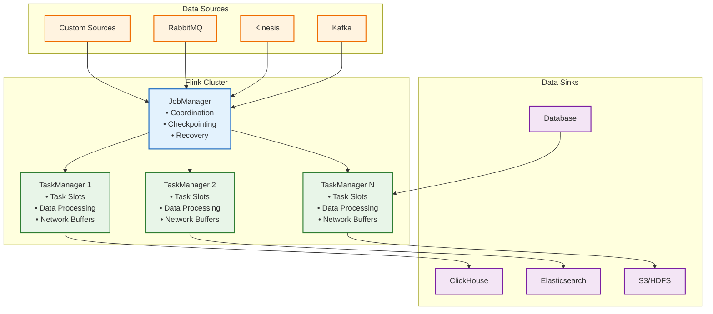
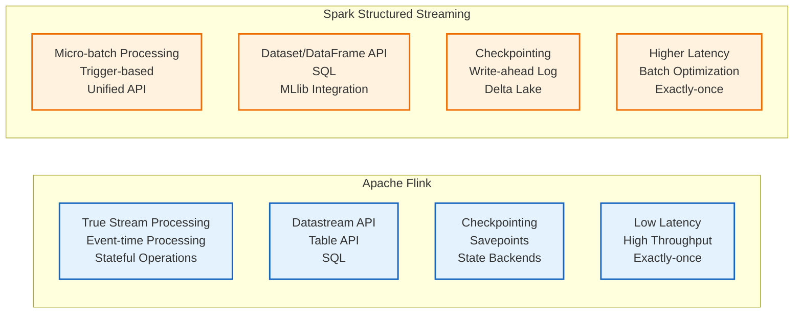

# Apache Flink Learning Guide

## 📚 Table of Contents

1. [Introduction to Stream Processing](#introduction-to-stream-processing)
2. [Apache Flink Fundamentals](#apache-flink-fundamentals)
3. [Data Ingestion Patterns](#data-ingestion-patterns)
4. [Data Consumption Strategies](#data-consumption-strategies)
5. [Flink Processing Concepts](#flink-processing-concepts)
6. [Windowing and State Management](#windowing-and-state-management)
7. [Flink vs Spark Structured Streaming](#flink-vs-spark-structured-streaming)
8. [Advanced Flink Features](#advanced-flink-features)
9. [Production Best Practices](#production-best-practices)
10. [Practical Examples](#practical-examples)

---

## 🌊 Introduction to Stream Processing

### What is Stream Processing?

Stream processing is the real-time processing of continuous data streams as they are generated, enabling immediate analysis, transformation, and action on data.

### Key Concepts

- **Event Time vs Processing Time**: When events occurred vs. when they're processed
- **Stateful Processing**: Maintaining state across events
- **Exactly-Once Semantics**: Ensuring each event is processed exactly once
- **Backpressure**: Handling rate mismatches between producers and consumers
- **Watermarks**: Tracking event time progress in out-of-order data

### Use Cases

- Real-time analytics and dashboards
- Fraud detection and alerting
- IoT data processing
- Log analysis and monitoring
- Real-time recommendations

---

## ⚡ Apache Flink Fundamentals

### Architecture Overview



### Core Components

#### 1. DataStream API
```java
// Java example
DataStream<Event> events = env
    .addSource(new FlinkKafkaConsumer<>(
        "events-topic",
        new EventDeserializer(),
        properties
    ))
    .keyBy(Event::getUserId)
    .window(TumblingEventTimeWindows.of(Time.minutes(5)))
    .process(new EventProcessor());
```

#### 2. Table API & SQL
```java
// Table API
Table events = tableEnv.fromDataStream(eventsStream);
Table result = events
    .filter($("eventType").isEqual("purchase"))
    .groupBy($("userId"))
    .select($("userId"), $("amount").sum().as("totalSpent"));

// SQL
tableEnv.createTemporaryView("events", eventsStream);
Table sqlResult = tableEnv.sqlQuery(
    "SELECT userId, SUM(amount) as totalSpent " +
    "FROM events " +
    "WHERE eventType = 'purchase' " +
    "GROUP BY userId"
);
```

#### 3. Stateful Functions
```java
public class EventProcessor extends KeyedProcessFunction<String, Event, Result> {
    private ValueState<Integer> eventCount;

    @Override
    public void open(Configuration parameters) {
        ValueStateDescriptor<Integer> descriptor =
            new ValueStateDescriptor<>("eventCount", Integer.class);
        eventCount = getRuntimeContext().getState(descriptor);
    }

    @Override
    public void processElement(Event event, Context ctx, Collector<Result> out) {
        Integer count = eventCount.value() == null ? 0 : eventCount.value();
        count++;
        eventCount.update(count);
        out.collect(new Result(event.getUserId(), count));
    }
}
```

---

## 📥 Data Ingestion Patterns

### 1. Kafka Integration

#### Basic Kafka Consumer
```java
FlinkKafkaConsumer<Event> kafkaSource = new FlinkKafkaConsumer<>(
    "clickstream-events",
    new EventDeserializer(),
    properties
);

// Start from latest offset
kafkaSource.setStartFromLatest();

// Start from earliest offset
kafkaSource.setStartFromEarliest();

// Start from specific timestamp
kafkaSource.setStartFromTimestamp(1633027200000L);

// Assign watermarks for event time
DataStream<Event> events = env
    .addSource(kafkaSource)
    .assignTimestampsAndWatermarks(
        WatermarkStrategy.<Event>forBoundedOutOfOrderness(Duration.ofSeconds(5))
            .withTimestampAssigner((event, timestamp) -> event.getTimestamp())
    );
```

#### Advanced Kafka Configuration
```java
Properties properties = new Properties();
properties.setProperty("bootstrap.servers", "localhost:9092");
properties.setProperty("group.id", "flink-consumer-group");
properties.setProperty("auto.offset.reset", "latest");
properties.setProperty("enable.auto.commit", "false");
properties.setProperty("isolation.level", "read_committed");

// Exactly-once semantics
env.enableCheckpointing(60000); // Checkpoint every 60 seconds
env.getCheckpointConfig().setCheckpointingMode(CheckpointingMode.EXACTLY_ONCE);
env.getCheckpointConfig().setMinPauseBetweenCheckpoints(30000);
```

### 2. File-based Sources

#### Reading from Files
```java
// CSV files
DataStream<Tuple3<String, String, Double>> csvData = env
    .readCsvFile("path/to/data.csv")
    .includeFields("1101") // Field mask for String, String, Double
    .types(String.class, String.class, Double.class);

// Parquet files
DataStream<Row> parquetData = env
    .createInput(new ParquetRowInputFormat<>(
        new Path("path/to/data.parquet"),
        new RowTypeInfo(typeInformation)
    ));
```

### 3. Custom Sources

#### Custom Source Function
```java
public class CustomEventSource extends RichParallelSourceFunction<Event> {
    private volatile boolean isRunning = true;
    private Random random = new Random();

    @Override
    public void run(SourceContext<Event> ctx) throws Exception {
        String[] eventTypes = {"page_view", "click", "purchase", "add_to_cart"};
        String[] users = {"user1", "user2", "user3", "user4", "user5"};

        while (isRunning) {
            Event event = new Event(
                users[random.nextInt(users.length)],
                eventTypes[random.nextInt(eventTypes.length)],
                System.currentTimeMillis(),
                random.nextDouble() * 100
            );

            synchronized (ctx.getCheckpointLock()) {
                ctx.collect(event);
            }

            Thread.sleep(100); // Control event rate
        }
    }

    @Override
    public void cancel() {
        isRunning = false;
    }
}
```

---

## 📤 Data Consumption Strategies

### 1. Windowing Strategies

#### Tumbling Windows
```java
DataStream<Event> events = ...;

// 5-minute tumbling windows
DataStream<Result> results = events
    .keyBy(Event::getUserId)
    .window(TumblingEventTimeWindows.of(Time.minutes(5)))
    .aggregate(new EventAggregator());

// Processing time windows
DataStream<Result> processingTimeResults = events
    .keyBy(Event::getUserId)
    .window(TumblingProcessingTimeWindows.of(Time.minutes(5)))
    .aggregate(new EventAggregator());
```

#### Sliding Windows
```java
// 1-hour windows sliding every 5 minutes
DataStream<Result> slidingResults = events
    .keyBy(Event::getUserId)
    .window(SlidingEventTimeWindows.of(Time.hours(1), Time.minutes(5)))
    .aggregate(new EventAggregator());
```

#### Session Windows
```java
// 30-minute session gap
DataStream<Result> sessionResults = events
    .keyBy(Event::getUserId)
    .window(EventTimeSessionWindows.withGap(Time.minutes(30)))
    .aggregate(new SessionAggregator());
```

### 2. State Management

#### Value State
```java
public class UserBehaviorProcessor extends KeyedProcessFunction<String, Event, UserStats> {
    private ValueState<UserStats> userStats;

    @Override
    public void open(Configuration parameters) {
        ValueStateDescriptor<UserStats> descriptor =
            new ValueStateDescriptor<>("userStats", UserStats.class);
        userStats = getRuntimeContext().getState(descriptor);
    }

    @Override
    public void processElement(Event event, Context ctx, Collector<UserStats> out) {
        UserStats stats = userStats.value() == null ? new UserStats() : userStats.value();

        stats.updateWithEvent(event);
        userStats.update(stats);

        out.collect(stats);
    }
}
```

#### List State
```java
public class EventBufferProcessor extends KeyedProcessFunction<String, Event, BufferedEvents> {
    private ListState<Event> eventBuffer;

    @Override
    public void open(Configuration parameters) {
        ListStateDescriptor<Event> descriptor =
            new ListStateDescriptor<>("eventBuffer", Event.class);
        eventBuffer = getRuntimeContext().getListState(descriptor);

        // Register cleanup timer
        long now = System.currentTimeMillis();
        long cleanupTime = now + Time.hours(1).toMilliseconds();
        ctx.timerService().registerProcessingTimeTimer(cleanupTime);
    }

    @Override
    public void processElement(Event event, Context ctx, Collector<BufferedEvents> out) {
        eventBuffer.add(event);
    }

    @Override
    public void onTimer(long timestamp, OnTimerContext ctx, Collector<BufferedEvents> out) {
        Iterable<Event> events = eventBuffer.get();
        // Process buffered events
        out.collect(new BufferedEvents(events));
        eventBuffer.clear();
    }
}
```

---

## ⚙️ Flink Processing Concepts

### 1. Operators and Transformations

#### Map Transformation
```java
DataStream<Event> events = ...;
DataStream<EnrichedEvent> enrichedEvents = events
    .map(new MapFunction<Event, EnrichedEvent>() {
        @Override
        public EnrichedEvent map(Event event) throws Exception {
            return new EnrichedEvent(
                event.getUserId(),
                event.getEventType(),
                event.getTimestamp(),
                event.getAmount(),
                System.currentTimeMillis() // Processing timestamp
            );
        }
    });
```

#### Filter Transformation
```java
DataStream<Event> purchaseEvents = events
    .filter(event -> "purchase".equals(event.getEventType()));
```

#### KeyBy Transformation
```java
KeyedStream<Event, String> keyedStream = events
    .keyBy(Event::getUserId);
```

#### Reduce Transformation
```java
DataStream<EventSummary> summaries = keyedStream
    .reduce((event1, event2) -> {
        double totalAmount = event1.getAmount() + event2.getAmount();
        int eventCount = event1.getEventCount() + event2.getEventCount();
        return new EventSummary(
            event1.getUserId(),
            totalAmount,
            eventCount,
            Math.max(event1.getTimestamp(), event2.getTimestamp())
        );
    });
```

### 2. Connect and CoProcessFunction

#### Connecting Two Streams
```java
DataStream<Event> events = ...;
DataStream<UserProfile> profiles = ...;

ConnectedStreams<Event, UserProfile> connected = events.connect(profiles);

DataStream<EnrichedEvent> enrichedEvents = connected
    .process(new CoProcessFunction<Event, UserProfile, EnrichedEvent>() {
        private ValueState<UserProfile> profileState;

        @Override
        public void open(Configuration parameters) {
            profileState = getRuntimeContext().getState(
                new ValueStateDescriptor<>("profile", UserProfile.class)
            );
        }

        @Override
        public void processElement1(Event event, Context ctx, Collector<EnrichedEvent> out) {
            UserProfile profile = profileState.value();
            if (profile != null) {
                out.collect(new EnrichedEvent(event, profile));
            }
        }

        @Override
        public void processElement2(UserProfile profile, Context ctx, Collector<EnrichedEvent> out) {
            profileState.update(profile);
        }
    });
```

### 3. Side Outputs

#### Splitting Streams
```java
final OutputTag<Event> suspiciousTag = new OutputTag<Event>("suspicious") {};

SingleOutputStreamOperator<Event> mainStream = events
    .process(new ProcessFunction<Event, Event>() {
        @Override
        public void processElement(Event event, Context ctx, Collector<Event> out) {
            if (isSuspicious(event)) {
                ctx.output(suspiciousTag, event);
            } else {
                out.collect(event);
            }
        }
    });

DataStream<Event> suspiciousEvents = mainStream.getSideOutput(suspiciousTag);
```

---

## 🪟 Windowing and State Management

### 1. Window Types Comparison

| Window Type | Use Case | Characteristics | Example |
|-------------|----------|------------------|----------|
| **Tumbling** | Fixed-size, non-overlapping | Clear boundaries, no overlap | 5-minute user activity summaries |
| **Sliding** | Moving averages, smooth trends | Overlapping windows | 1-hour average every 15 minutes |
| **Session** | User sessions, activity bursts | Dynamic size based on gaps | 30-minute session windows |
| **Global** | Aggregations across all data | Single window per key | Total count per user |
| **Count** | Event-based windows | Triggered by event count | Every 100 events per user |

### 2. Window Functions

#### Aggregate Function
```java
public class EventAggregateFunction implements AggregateFunction<Event, EventAccumulator, EventSummary> {
    @Override
    public EventAccumulator createAccumulator() {
        return new EventAccumulator();
    }

    @Override
    public EventAccumulator add(Event event, EventAccumulator accumulator) {
        accumulator.addEvent(event);
        return accumulator;
    }

    @Override
    public EventSummary getResult(EventAccumulator accumulator) {
        return accumulator.toSummary();
    }

    @Override
    public EventAccumulator merge(EventAccumulator a, EventAccumulator b) {
        a.merge(b);
        return a;
    }
}
```

#### ProcessWindowFunction
```java
public class WindowedEventProcessor extends ProcessWindowFunction<
    Event, EventSummary, String, TimeWindow> {

    @Override
    public void process(String key, Context ctx, Iterable<Event> events, Collector<EventSummary> out) {
        long windowStart = ctx.window().getStart();
        long windowEnd = ctx.window().getEnd();

        int eventCount = 0;
        double totalAmount = 0.0;

        for (Event event : events) {
            eventCount++;
            totalAmount += event.getAmount();
        }

        out.collect(new EventSummary(key, eventCount, totalAmount, windowStart, windowEnd));
    }
}
```

### 3. State Backend Configuration

#### Memory State Backend
```java
Configuration config = new Configuration();
config.setString("state.backend", "memory");
config.setString("state.checkpoints.dir", "file:///path/to/checkpoints");
config.setString("state.savepoints.dir", "file:///path/to/savepoints");
```

#### RocksDB State Backend
```java
Configuration config = new Configuration();
config.setString("state.backend", "rocksdb");
config.setString("state.backend.rocksdb.localdir", "/path/to/rocksdb");
config.setString("state.checkpoints.dir", "hdfs:///path/to/checkpoints");
config.setString("state.savepoints.dir", "hdfs:///path/to/savepoints");
```

---

## ⚔️ Flink vs Spark Structured Streaming

### Architecture Comparison



### Feature Comparison

| Feature | Apache Flink | Spark Structured Streaming |
|---------|--------------|----------------------------|
| **Processing Model** | True stream processing | Micro-batch processing |
| **Latency** | Milliseconds | 100ms - seconds |
| **Event Time** | Native support | Supported via watermarks |
| **State Management** | Rich state backends | Limited state support |
| **Windowing** | Advanced window functions | Basic windowing |
| **Backpressure** | Automatic | Manual tuning |
| **Exactly-once** | Native with checkpoints | Via write-ahead log |
| **Ecosystem** | Growing | Mature (Spark ecosystem) |
| **Learning Curve** | Steeper | Gentler |
| **Batch Processing** | Possible (DataSet API) | Native (Spark Core) |

### Performance Characteristics

#### Flink Performance
- **Latency**: 1-10ms
- **Throughput**: 100M+ events/sec
- **State Size**: Terabytes with RocksDB
- **Fault Tolerance**: Sub-second recovery
- **Scalability**: Thousands of nodes

#### Spark Performance
- **Latency**: 100ms - 1s
- **Throughput**: 10M+ events/sec
- **State Size**: Limited by driver memory
- **Fault Tolerance**: Seconds to minutes
- **Scalability**: Hundreds of nodes

### Code Comparison

#### Flink Implementation
```java
// Flink DataStream API
DataStream<Event> events = env
    .addSource(new FlinkKafkaConsumer<>(...))
    .assignTimestampsAndWatermarks(WatermarkStrategy.forBoundedOutOfOrderness(Duration.ofSeconds(5)))
    .keyBy(Event::getUserId)
    .window(TumblingEventTimeWindows.of(Time.minutes(5)))
    .aggregate(new EventAggregateFunction());

events.addSink(new FlinkKafkaProducer<>(...));
```

#### Spark Implementation
```scala
// Spark Structured Streaming
val events = spark
    .readStream
    .format("kafka")
    .option("kafka.bootstrap.servers", "localhost:9092")
    .option("subscribe", "events-topic")
    .load()
    .selectExpr("CAST(value AS STRING) as json")
    .select(from_json($"json", schema).as("event"))
    .select("event.*")
    .withWatermark("timestamp", "5 seconds")

val results = events
    .groupBy(
        window($"timestamp", "5 minutes"),
        $"userId"
    )
    .agg(
        count("*").as("eventCount"),
        sum("amount").as("totalAmount")
    )

val query = results
    .writeStream
    .format("console")
    .outputMode("complete")
    .start()
```

### When to Choose Which

#### Choose Flink When:
- Low latency (sub-second) is critical
- Complex stateful processing is needed
- Event-time processing with out-of-order events
- Advanced windowing operations
- True stream processing model preferred
- Large state management required

#### Choose Spark When:
- Already using Spark ecosystem
- Batch and stream processing unification needed
- Machine learning integration required
- Easier learning curve preferred
- SQL-heavy workloads
- Mature ecosystem and community needed

---

## 🚀 Advanced Flink Features

### 1. Complex Event Processing (CEP)

```java
// Define event patterns
Pattern<Event, ?> pattern = Pattern.<Event>begin("start")
    .where(new SimpleCondition<Event>() {
        @Override
        public boolean filter(Event event) {
            return "login".equals(event.getEventType());
        }
    })
    .next("middle")
    .where(new SimpleCondition<Event>() {
        @Override
        public boolean filter(Event event) {
            return "page_view".equals(event.getEventType());
        }
    })
    .within(Time.minutes(30));

// Apply CEP pattern
PatternStream<Event> patternStream = CEP.pattern(events, pattern);

DataStream<Alert> alerts = patternStream.select((pattern) -> {
    Event startEvent = pattern.get("start").get(0);
    Event middleEvent = pattern.get("middle").get(0);
    return new Alert("User session detected", startEvent.getUserId());
});
```

### 2. Machine Learning Integration

```java
// Online machine learning with Flink ML
DataStream<Vector> features = events
    .map(new FeatureExtractor())
    .keyBy(Vector::getUser)
    .window(TumblingEventTimeWindows.of(Time.minutes(10)))
    .process(new FeatureAggregator());

// Train model
OnlineLearningModel model = new OnlineLearningModel()
    .setFeaturesCol("features")
    .setLabelCol("label")
    .setPredictionCol("prediction");

DataStream<Prediction> predictions = model.transform(features);
```

### 3. Async I/O Operations

```java
// Async database lookups
DataStream<EnrichedEvent> enrichedEvents = events
    .keyBy(Event::getUserId)
    .asyncOperation(new AsyncFunction<String, UserProfile>() {
        @Override
        public void asyncInvoke(String userId, ResultFuture<UserProfile> resultFuture) {
            CompletableFuture.supplyAsync(() -> {
                return databaseClient.getUserProfile(userId);
            }).thenAccept(profile -> {
                resultFuture.complete(Collections.singleton(profile));
            });
        }
    });
```

### 4. Dynamic Scaling

```java
// Manual scaling
StreamExecutionEnvironment env = StreamExecutionEnvironment.getExecutionEnvironment();
env.setParallelism(4); // Set parallelism

// Auto-scaling with Kubernetes
// Use Flink Kubernetes operator for dynamic scaling
```

---

## 🏭 Production Best Practices

### 1. Monitoring and Observability

#### Metrics Configuration
```java
// Enable metrics
Configuration config = new Configuration();
config.setString("metrics.reporter.prom.class", "org.apache.flink.metrics.prometheus.PrometheusReporter");
config.setString("metrics.reporter.prom.port", "9999");

// Custom metrics
public class EventProcessor extends ProcessFunction<Event, Result> {
    private Counter eventCounter;
    private Histogram eventLatency;

    @Override
    public void open(Configuration parameters) {
        eventCounter = getRuntimeContext()
            .getMetricGroup()
            .counter("events.processed");

        eventLatency = getRuntimeContext()
            .getMetricGroup()
            .histogram("event.latency", new Histogram());
    }

    @Override
    public void processElement(Event event, Context ctx, Collector<Result> out) {
        long latency = System.currentTimeMillis() - event.getTimestamp();
        eventLatency.update(latency);
        eventCounter.inc();

        // Processing logic
        out.collect(processEvent(event));
    }
}
```

### 2. Checkpointing Configuration

```java
// Optimal checkpointing configuration
StreamExecutionEnvironment env = StreamExecutionEnvironment.getExecutionEnvironment();

// Enable checkpointing
env.enableCheckpointing(60000); // 1 minute intervals

// Advanced checkpointing
env.getCheckpointConfig().setCheckpointingMode(CheckpointingMode.EXACTLY_ONCE);
env.getCheckpointConfig().setMinPauseBetweenCheckpoints(30000);
env.getCheckpointConfig().setCheckpointTimeout(600000);
env.getCheckpointConfig().setMaxConcurrentCheckpoints(1);
env.getCheckpointConfig().setExternalizedCheckpointCleanup(
    ExternalizedCheckpointCleanup.RETAIN_ON_CANCELLATION
);

// State backend
env.setStateBackend(new EmbeddedRocksDBStateBackend());
env.getCheckpointConfig().setCheckpointStorage("hdfs:///flink/checkpoints");
```

### 3. Resource Management

#### Memory Configuration
```java
// Task Manager memory configuration
Configuration config = new Configuration();
config.setDouble("taskmanager.memory.network.fraction", 0.1);
config.setDouble("taskmanager.memory.managed.fraction", 0.4);
config.setString("taskmanager.memory.size", "4g");
```

#### Slot Allocation
```java
// Optimal slot allocation
StreamExecutionEnvironment env = StreamExecutionEnvironment.getExecutionEnvironment();
env.setParallelism(12); // Match number of cores

// Configure slots per task manager
env.getConfig().setNumberOfExecutionRetries(3);
env.getConfig().setRestartStrategy(RestartStrategies.fixedDelayRestart(
    3, // max restart attempts
    Time.seconds(10) // restart interval
));
```

### 4. Error Handling and Recovery

#### Custom Error Handling
```java
public class SafeEventProcessor extends ProcessFunction<Event, Result> {
    private static final Logger LOG = LoggerFactory.getLogger(SafeEventProcessor.class);

    @Override
    public void processElement(Event event, Context ctx, Collector<Result> out) {
        try {
            Result result = processEventSafely(event);
            out.collect(result);
        } catch (Exception e) {
            LOG.error("Failed to process event: " + event, e);

            // Emit error metric
            getRuntimeContext()
                .getMetricGroup()
                .counter("processing.errors")
                .inc();

            // Optionally send to dead-letter queue
            ctx.output(errorTag, new ErrorEvent(event, e.getMessage()));
        }
    }

    private Result processEventSafely(Event event) {
        // Processing logic with validation
        if (event.getUserId() == null) {
            throw new IllegalArgumentException("User ID cannot be null");
        }
        return processEvent(event);
    }
}
```

---

## 💡 Practical Examples

### 1. Real-time E-commerce Analytics

```java
public class EcommerceAnalyticsJob {
    public static void main(String[] args) throws Exception {
        StreamExecutionEnvironment env = StreamExecutionEnvironment.getExecutionEnvironment();

        // Configure event time processing
        WatermarkStrategy<Event> watermarkStrategy = WatermarkStrategy
            .<Event>forBoundedOutOfOrderness(Duration.ofSeconds(5))
            .withTimestampAssigner((event, timestamp) -> event.getTimestamp());

        // Kafka source
        FlinkKafkaConsumer<Event> kafkaSource = new FlinkKafkaConsumer<>(
            "ecommerce-events",
            new EventDeserializer(),
            getKafkaProperties()
        );

        DataStream<Event> events = env
            .addSource(kafkaSource)
            .assignTimestampsAndWatermarks(watermarkStrategy)
            .name("Kafka Source");

        // Real-time metrics pipeline
        DataStream<RealTimeMetrics> metrics = events
            .keyBy(Event::getUserId)
            .window(TumblingEventTimeWindows.of(Time.minutes(5)))
            .aggregate(new MetricsAggregator())
            .name("Real-time Metrics");

        // Fraud detection pipeline
        DataStream<FraudAlert> fraudAlerts = events
            .keyBy(Event::getUserId)
            .process(new FraudDetectionProcessor())
            .name("Fraud Detection");

        // Product recommendations
        DataStream<Recommendation> recommendations = events
            .keyBy(Event::getUserId)
            .window(SlidingEventTimeWindows.of(Time.hours(1), Time.minutes(15)))
            .aggregate(new BehaviorAggregator())
            .name("Recommendation Engine");

        // Sinks
        metrics.addSink(getClickHouseSink());
        fraudAlerts.addSink(getAlertSink());
        recommendations.addSink(getRecommendationSink());

        env.execute("E-commerce Analytics Pipeline");
    }
}
```

### 2. IoT Data Processing

```java
public class IoTPipelineJob {
    public static void main(String[] args) throws Exception {
        StreamExecutionEnvironment env = StreamExecutionEnvironment.getExecutionEnvironment();

        // MQTT source for IoT devices
        DataStream<SensorReading> readings = env
            .addSource(new MqttSource("tcp://mqtt-broker:1883", "sensors/+/data"))
            .name("MQTT Source");

        // Data validation and cleaning
        DataStream<ValidReading> validReadings = readings
            .filter(reading -> reading.getValue() != null && reading.getValue() >= 0)
            .map(new SensorDataValidator())
            .name("Data Validation");

        // Anomaly detection
        DataStream<Anomaly> anomalies = validReadings
            .keyBy(SensorReading::getDeviceId)
            .process(new AnomalyDetector())
            .name("Anomaly Detection");

        // Aggregation for dashboard
        DataStream<DeviceStats> stats = validReadings
            .keyBy(SensorReading::getDeviceId)
            .window(TumblingEventTimeWindows.of(Time.minutes(5)))
            .aggregate(new StatsAggregator())
            .name("Device Statistics");

        // Predictive maintenance
        DataStream<MaintenanceAlert> maintenanceAlerts = validReadings
            .keyBy(SensorReading::getDeviceId)
            .window(SlidingEventTimeWindows.of(Time.hours(24), Time.hours(1)))
            .process(new PredictiveMaintenanceProcessor())
            .name("Predictive Maintenance");

        // Sinks
        stats.addSink(getInfluxDbSink());
        anomalies.addSink(getAlertSink());
        maintenanceAlerts.addSink(getMaintenanceSink());

        env.execute("IoT Data Processing Pipeline");
    }
}
```

### 3. Real-time Log Analysis

```java
public class LogAnalysisJob {
    public static void main(String[] args) throws Exception {
        StreamExecutionEnvironment env = StreamExecutionEnvironment.getExecutionEnvironment();

        // Log source (file or Kafka)
        DataStream<LogEvent> logs = env
            .readTextFile("/path/to/logs")
            .map(new LogParser())
            .name("Log Parser");

        // Error rate monitoring
        DataStream<ErrorStats> errorStats = logs
            .filter(log -> log.getLevel().equals("ERROR"))
            .keyBy(LogEvent::getService)
            .window(TumblingEventTimeWindows.of(Time.minutes(5)))
            .aggregate(new ErrorRateAggregator())
            .name("Error Rate Monitoring");

        // Pattern detection
        Pattern<LogEvent, ?> errorPattern = Pattern.<LogEvent>begin("error")
            .where(new SimpleCondition<LogEvent>() {
                @Override
                public boolean filter(LogEvent log) {
                    return "ERROR".equals(log.getLevel());
                }
            })
            .times(5) // 5 errors in sequence
            .within(Time.minutes(1));

        PatternStream<LogEvent> patternStream = CEP.pattern(logs, errorPattern);
        DataStream<ServiceAlert> alerts = patternStream.select(pattern -> {
            List<LogEvent> errors = pattern.get("error");
            return new ServiceAlert(
                errors.get(0).getService(),
                "High error rate detected",
                errors.size()
            );
        });

        // Performance metrics
        DataStream<PerformanceMetrics> performance = logs
            .keyBy(LogEvent::getService)
            .window(TumblingEventTimeWindows.of(Time.minutes(1)))
            .process(new PerformanceAnalyzer())
            .name("Performance Analysis");

        // Sinks
        errorStats.addSink(getElasticsearchSink());
        alerts.addSink(getAlertManagerSink());
        performance.addSink(getGrafanaSink());

        env.execute("Real-time Log Analysis");
    }
}
```

---

## 📚 Learning Resources

### Official Documentation
- [Apache Flink Documentation](https://flink.apache.org/docs/)
- [Flink Training](https://training.ververica.com/)
- [Flink Forward Talks](https://flink-forward.org/)

### Books
- "Stream Processing with Apache Flink" by Fabian Hueske and Vasia Kalavri
- "Big Data: Principles and best practices of scalable realtime data systems" by Nathan Marz

### Online Courses
- [Dataflow and Beam Programming on GCP](https://www.coursera.org/learn/dataflow-beam)
- [Stream Processing with Apache Flink](https://www.pluralsight.com/courses/apache-flink)

### Community
- [Flink User Mailing List](https://flink.apache.org/community.html)
- [Stack Overflow](https://stackoverflow.com/questions/tagged/apache-flink)
- [Flink Slack Channel](https://flink.apache.org/community.html)

### Tools and Libraries
- [Flink Kubernetes Operator](https://github.com/spotify/flink-on-k8s-operator)
- [Flink ML](https://flink.apache.org/libs/ml/)
- [Flink CEP](https://ci.apache.org/projects/flink/flink-docs-stable/dev/libs/cep.html)

---

## 🎯 Conclusion

Apache Flink is a powerful stream processing framework that excels in real-time data processing scenarios. Its true stream processing model, advanced windowing capabilities, and rich state management make it ideal for low-latency, stateful applications.

When comparing with Spark Structured Streaming, Flink offers better performance for true streaming workloads but has a steeper learning curve. The choice between them depends on specific use cases, existing infrastructure, and team expertise.

This guide provides a comprehensive foundation for learning Flink, from basic concepts to advanced features and production best practices. Continue experimenting with different patterns and stay engaged with the Flink community for the latest developments.

---

**Happy Stream Processing! 🚀**