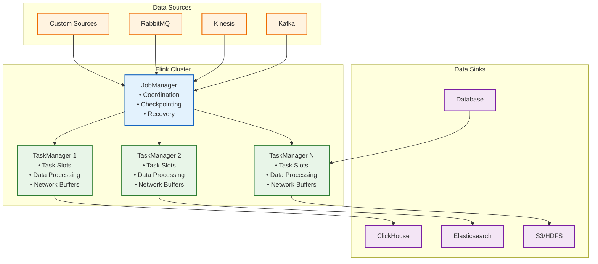
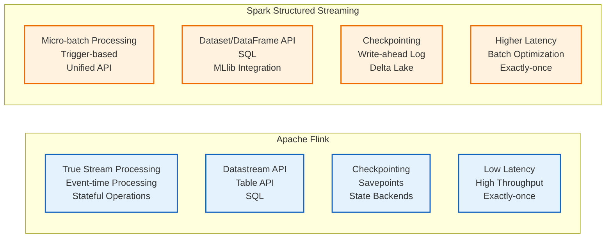

# Apache Flink Learning Guide

## 📚 Table of Contents

1. [Introduction to Stream Processing](#introduction-to-stream-processing)
2. [Apache Flink Fundamentals](#apache-flink-fundamentals)
3. [Data Ingestion Patterns](#data-ingestion-patterns)
4. [Data Consumption Strategies](#data-consumption-strategies)
5. [Flink Processing Concepts](#flink-processing-concepts)
6. [Windowing and State Management](#windowing-and-state-management)
7. [Flink vs Spark Structured Streaming](#flink-vs-spark-structured-streaming)
8. [Advanced Flink Features](#advanced-flink-features)
9. [Production Best Practices](#production-best-practices)
10. [Practical Examples](#practical-examples)

---

## 🌊 Introduction to Stream Processing

### What is Stream Processing?

Stream processing is the real-time processing of continuous data streams as they are generated, enabling immediate analysis, transformation, and action on data.

### Key Concepts

- **Event Time vs Processing Time**: When events occurred vs. when they're processed
- **Stateful Processing**: Maintaining state across events
- **Exactly-Once Semantics**: Ensuring each event is processed exactly once
- **Backpressure**: Handling rate mismatches between producers and consumers
- **Watermarks**: Tracking event time progress in out-of-order data

### Use Cases

- Real-time analytics and dashboards
- Fraud detection and alerting
- IoT data processing
- Log analysis and monitoring
- Real-time recommendations

---

## ⚡ Apache Flink Fundamentals

### Architecture Overview



### Core Components

#### 1. DataStream API (Python)
```python
from pyflink.datastream import StreamExecutionEnvironment
from pyflink.datastream.connectors import FlinkKafkaConsumer
from pyflink.datastream.windowing import Time, TumblingEventTimeWindows
from pyflink.common.watermarks import WatermarkStrategy
from pyflink.common.serialization import SimpleStringSchema

env = StreamExecutionEnvironment.get_execution_environment()

# Kafka source
properties = {
    'bootstrap.servers': 'localhost:9092',
    'group.id': 'python-consumer'
}

kafka_source = FlinkKafkaConsumer(
    topics='events-topic',
    value_serializer=SimpleStringSchema(),
    properties=properties
)

# Create datastream
events = env.add_source(kafka_source)
    .assign_timestamps_and_watermarks(
        WatermarkStrategy.for_bounded_out_of_orderness(
            duration=5000  # 5 seconds
        )
    )
    .key_by(lambda event: event['user_id'])
    .window(TumblingEventTimeWindows.of(Time.minutes(5)))
    .process(EventProcessor())
```

#### 2. Table API & SQL (Python)
```python
from pyflink.table import StreamTableEnvironment
from pyflink.table.expressions import col, lit

# Create table environment
table_env = StreamTableEnvironment.create(env)

# Convert DataStream to Table
events_table = table_env.from_data_stream(events_stream)

# Table API operations
result = events_table.filter(
    col('event_type') == lit('purchase')
).group_by(
    col('user_id')
).select(
    col('user_id'),
    col('amount').sum.alias('total_spent')
)

# SQL operations
table_env.create_temporary_view('events', events_stream)
sql_result = table_env.sql_query("""
    SELECT
        user_id,
        SUM(amount) as total_spent
    FROM events
    WHERE event_type = 'purchase'
    GROUP BY user_id
""")
```

#### 3. Simple Processing Functions (Python)
```python
from pyflink.datastream.functions import KeyedProcessFunction, RuntimeContext
from pyflink.common.state import ValueState, ValueStateDescriptor

class EventProcessor(KeyedProcessFunction):
    def __init__(self):
        self.event_count = None

    def open(self, runtime_context: RuntimeContext):
        # Initialize state
        descriptor = ValueStateDescriptor('event_count', int)
        self.event_count = runtime_context.get_state(descriptor)

    def process_element(self, event, ctx, collector):
        # Get current count or initialize to 0
        count = self.event_count.value() or 0
        count += 1

        # Update state
        self.event_count.update(count)

        # Collect result
        collector.collect({
            'user_id': event['user_id'],
            'event_count': count,
            'timestamp': event['timestamp']
        })
```

---

## 📥 Data Ingestion Patterns

### 1. Kafka Integration

#### Basic Kafka Consumer (Python)
```python
from pyflink.datastream import StreamExecutionEnvironment
from pyflink.datastream.connectors import FlinkKafkaConsumer
from pyflink.common.serialization import SimpleStringSchema, JsonRowDeserializationSchema
from pyflink.common.watermarks import WatermarkStrategy
from pyflink.common.typeinfo import Types
import json

env = StreamExecutionEnvironment.get_execution_environment()

# Kafka configuration
properties = {
    'bootstrap.servers': 'localhost:9092',
    'group.id': 'flink-consumer-group',
    'auto.offset.reset': 'latest',
    'enable.auto.commit': 'false'
}

# Define event schema
schema = Types.ROW_NAMED(
    ['user_id', 'event_type', 'timestamp', 'amount'],
    [Types.STRING(), Types.STRING(), Types.INT(), Types.DOUBLE()]
)

# Create Kafka consumer
kafka_consumer = FlinkKafkaConsumer(
    topics='clickstream-events',
    deserialization_schema=JsonRowDeserializationSchema(schema),
    properties=properties
)

# Set starting offset
kafka_consumer.set_start_from_latest()  # or set_start_from_earliest()

# Create datastream with watermarks
events = env.add_source(kafka_consumer)
    .assign_timestamps_and_watermarks(
        WatermarkStrategy.for_bounded_out_of_orderness(
            duration=5000  # 5 seconds
        ).with_timestamp_assigner(lambda event, timestamp: event['timestamp'])
    )
```

#### Advanced Kafka Configuration (Python)
```python
# Enable exactly-once semantics
env.enable_checkpointing(60000)  # Checkpoint every 60 seconds

# Configure checkpointing
env.get_checkpoint_config().set_checkpointing_mode(
    CheckpointingMode.EXACTLY_ONCE
)
env.get_checkpoint_config().set_min_pause_between_checkpoints(30000)
env.get_checkpoint_config().set_checkpoint_timeout(600000)
env.get_checkpoint_config().set_externalized_checkpoint_cleanup(
    ExternalizedCheckpointCleanup.RETAIN_ON_CANCELLATION
)

# Advanced Kafka properties
advanced_properties = {
    'bootstrap.servers': 'localhost:9092',
    'group.id': 'flink-consumer-group',
    'auto.offset.reset': 'latest',
    'enable.auto.commit': 'false',
    'isolation.level': 'read_committed',
    'key.deserializer': 'org.apache.kafka.common.serialization.StringDeserializer',
    'value.deserializer': 'org.apache.kafka.common.serialization.StringDeserializer'
}
```

### 2. File-based Sources

#### Reading from Files (Python)
```python
from pyflink.datastream.connectors import FileSource, StreamFormat
from pyflink.datastream.connectors.file_system import FileSink, OutputFileConfig
from pyflink.common.serialization import SimpleStringEncoder, Encoder

# Read CSV files
file_source = FileSource.for_record_stream_format(
    StreamFormat.text_line_format(),
    '/path/to/data/*.csv'
).build()

csv_stream = env.from_source(
    source=file_source,
    watermark_strategy=WatermarkStrategy.no_watermarks(),
    source_name='CSV Source'
)

# Read JSON files
json_source = FileSource.for_record_stream_format(
    StreamFormat.json_line_format(),
    '/path/to/data/*.json'
).build()

json_stream = env.from_source(
    source=json_source,
    watermark_strategy=WatermarkStrategy.for_monotonous_timestamps(),
    source_name='JSON Source'
)
```

### 3. Custom Sources

#### Custom Source Function (Python)
```python
from pyflink.datastream.functions import SourceFunction, RuntimeContext
from pyflink.datastream.functions.context import SourceContext
import random
import time
import json

class CustomEventSource(SourceFunction):
    def __init__(self, events_per_second=10):
        self.events_per_second = events_per_second
        self.is_running = False

    def run(self, ctx: SourceContext):
        self.is_running = True

        event_types = ['page_view', 'click', 'purchase', 'add_to_cart']
        users = ['user1', 'user2', 'user3', 'user4', 'user5']
        products = ['prod1', 'prod2', 'prod3', 'prod4', 'prod5']

        while self.is_running:
            # Generate random event
            event = {
                'user_id': random.choice(users),
                'event_type': random.choice(event_types),
                'product_id': random.choice(products),
                'timestamp': int(time.time() * 1000),  # milliseconds
                'amount': round(random.uniform(1, 100), 2),
                'session_id': f"session_{random.randint(1000, 9999)}"
            }

            # Collect event
            ctx.collect(event)

            # Control event rate
            time.sleep(1.0 / self.events_per_second)

    def cancel(self):
        self.is_running = False

# Use custom source
custom_source = CustomEventSource(events_per_second=100)
events = env.add_source(custom_source, source_name='Custom Event Source')
```

### 4. SQL-based Data Ingestion

#### Using SQL for Data Ingestion
```sql
-- Create Kafka connector table in SQL
CREATE TABLE kafka_events (
    user_id STRING,
    event_type STRING,
    timestamp BIGINT,
    amount DOUBLE,
    product_id STRING,
    session_id STRING,
    WATERMARK FOR timestamp AS timestamp - INTERVAL '5' SECOND
) WITH (
    'connector' = 'kafka',
    'topic' = 'clickstream-events',
    'properties.bootstrap.servers' = 'localhost:9092',
    'properties.group.id' = 'flink-consumer',
    'format' = 'json',
    'scan.startup.mode' = 'latest-offset'
);

-- Create filesystem connector table
CREATE TABLE file_events (
    user_id STRING,
    event_type STRING,
    timestamp BIGINT,
    amount DOUBLE,
    product_id STRING,
    session_id STRING
) WITH (
    'connector' = 'filesystem',
    'path' = 'file:///path/to/output',
    'format' = 'json',
    'sink.partition-commit.delay' = '1 min'
);

-- Simple ETL pipeline using SQL
INSERT INTO file_events
SELECT
    user_id,
    event_type,
    timestamp,
    amount,
    product_id,
    session_id
FROM kafka_events
WHERE event_type IN ('purchase', 'add_to_cart');
```

---

## 📤 Data Consumption Strategies

### 1. Windowing Strategies

#### Tumbling Windows (Python)
```python
from pyflink.datastream.windowing import Time, TumblingEventTimeWindows, TumblingProcessingTimeWindows
from pyflink.datastream.functions import AggregateFunction

# 5-minute tumbling windows (event time)
results = events.key_by(lambda event: event['user_id']) \
    .window(TumblingEventTimeWindows.of(Time.minutes(5))) \
    .aggregate(EventAggregator())

# 5-minute tumbling windows (processing time)
processing_time_results = events.key_by(lambda event: event['user_id']) \
    .window(TumblingProcessingTimeWindows.of(Time.minutes(5))) \
    .aggregate(EventAggregator())
```

#### Sliding Windows (Python)
```python
from pyflink.datastream.windowing import SlidingEventTimeWindows

# 1-hour windows sliding every 5 minutes
sliding_results = events.key_by(lambda event: event['user_id']) \
    .window(SlidingEventTimeWindows.of(Time.hours(1), Time.minutes(5))) \
    .aggregate(EventAggregator())
```

#### Session Windows (Python)
```python
from pyflink.datastream.windowing import EventTimeSessionWindows

# 30-minute session gap
session_results = events.key_by(lambda event: event['user_id']) \
    .window(EventTimeSessionWindows.with_gap(Time.minutes(30))) \
    .aggregate(SessionAggregator())
```

#### Count Windows (Python)
```python
from pyflink.datastream.windowing import GlobalWindows, CountTrigger

# Window every 100 events per user
count_results = events.key_by(lambda event: event['user_id']) \
    .window(GlobalWindows()) \
    .trigger(CountTrigger.of(100)) \
    .aggregate(CountWindowAggregator())
```

### 2. State Management (Python)

#### Value State
```python
from pyflink.datastream.functions import KeyedProcessFunction, RuntimeContext
from pyflink.common.state import ValueState, ValueStateDescriptor
from pyflink.common.typeinfo import Types

class UserBehaviorProcessor(KeyedProcessFunction):
    def __init__(self):
        self.user_stats = None

    def open(self, runtime_context: RuntimeContext):
        # Initialize value state
        descriptor = ValueStateDescriptor(
            'user_stats',
            Types.ROW_NAMED(
                ['total_events', 'total_amount', 'last_event_time'],
                [Types.INT(), Types.DOUBLE(), Types.INT()]
            )
        )
        self.user_stats = runtime_context.get_state(descriptor)

    def process_element(self, event, ctx, collector):
        # Get current stats or initialize
        stats = self.user_stats.value() or {
            'total_events': 0,
            'total_amount': 0.0,
            'last_event_time': 0
        }

        # Update stats
        stats['total_events'] += 1
        stats['total_amount'] += event.get('amount', 0)
        stats['last_event_time'] = event.get('timestamp', 0)

        # Update state
        self.user_stats.update(stats)

        # Collect result
        collector.collect({
            'user_id': event['user_id'],
            'stats': stats
        })
```

#### List State
```python
from pyflink.common.state import ListState, ListStateDescriptor
from pyflink.common.typeinfo import Types
import time

class EventBufferProcessor(KeyedProcessFunction):
    def __init__(self):
        self.event_buffer = None

    def open(self, runtime_context: RuntimeContext):
        # Initialize list state
        descriptor = ListStateDescriptor(
            'event_buffer',
            Types.ROW_NAMED(
                ['user_id', 'event_type', 'timestamp', 'amount'],
                [Types.STRING(), Types.STRING(), Types.INT(), Types.DOUBLE()]
            )
        )
        self.event_buffer = runtime_context.get_list_state(descriptor)

        # Register cleanup timer (1 hour from now)
        cleanup_time = int(time.time() * 1000) + (60 * 60 * 1000)
        ctx.timer_service().register_processing_time_timer(cleanup_time)

    def process_element(self, event, ctx, collector):
        # Add event to buffer
        self.event_buffer.add(event)

    def on_timer(self, timestamp, ctx, collector):
        # Get all buffered events
        buffered_events = list(self.event_buffer.get())

        if buffered_events:
            # Process buffered events
            result = {
                'buffer_size': len(buffered_events),
                'events': buffered_events,
                'processing_time': timestamp
            }
            collector.collect(result)

        # Clear buffer
        self.event_buffer.clear()
```

#### Map State
```python
from pyflink.common.state import MapState, MapStateDescriptor

class ProductAnalyticsProcessor(KeyedProcessFunction):
    def __init__(self):
        self.product_counts = None

    def open(self, runtime_context: RuntimeContext):
        # Initialize map state for product counts
        descriptor = MapStateDescriptor(
            'product_counts',
            Types.STRING(),  # Key: product_id
            Types.ROW_NAMED(['count', 'revenue'], [Types.INT(), Types.DOUBLE()])  # Value
        )
        self.product_counts = runtime_context.get_map_state(descriptor)

    def process_element(self, event, ctx, collector):
        product_id = event.get('product_id')
        amount = event.get('amount', 0)

        # Get current product stats or initialize
        if self.product_counts.contains(product_id):
            stats = self.product_counts.get(product_id)
            stats['count'] += 1
            stats['revenue'] += amount
        else:
            stats = {'count': 1, 'revenue': amount}

        # Update map state
        self.product_counts.put(product_id, stats)

        # Emit updated analytics
        collector.collect({
            'product_id': product_id,
            'analytics': stats
        })
```

### 3. SQL Windowing

#### Window Functions in SQL
```sql
-- Tumbling window (5-minute)
INSERT INTO purchase_stats
SELECT
    user_id,
    TUMBLE_START(timestamp, INTERVAL '5' MINUTES) as window_start,
    TUMBLE_END(timestamp, INTERVAL '5' MINUTES) as window_end,
    COUNT(*) as event_count,
    SUM(amount) as total_amount
FROM kafka_events
WHERE event_type = 'purchase'
GROUP BY
    user_id,
    TUMBLE(timestamp, INTERVAL '5' MINUTES);

-- Sliding window (1-hour window, 5-minute slide)
INSERT INTO sliding_purchase_stats
SELECT
    user_id,
    HOP_START(timestamp, INTERVAL '5' MINUTES, INTERVAL '1' HOUR) as window_start,
    HOP_END(timestamp, INTERVAL '5' MINUTES, INTERVAL '1' HOUR) as window_end,
    COUNT(*) as event_count,
    SUM(amount) as total_amount
FROM kafka_events
WHERE event_type = 'purchase'
GROUP BY
    user_id,
    HOP(timestamp, INTERVAL '5' MINUTES, INTERVAL '1' HOUR);

-- Session window
INSERT INTO session_stats
SELECT
    user_id,
    SESSION_START(timestamp, INTERVAL '30' MINUTES) as session_start,
    SESSION_END(timestamp, INTERVAL '30' MINUTES) as session_end,
    COUNT(*) as event_count,
    SUM(amount) as total_amount
FROM kafka_events
GROUP BY
    user_id,
    SESSION(timestamp, INTERVAL '30' MINUTES);
```

---

## ⚙️ Flink Processing Concepts

### 1. Operators and Transformations (Python)

#### Map Transformation
```python
from pyflink.datastream.functions import MapFunction

class EventEnricher(MapFunction):
    def map(self, event):
        import time
        return {
            'user_id': event['user_id'],
            'event_type': event['event_type'],
            'timestamp': event['timestamp'],
            'amount': event['amount'],
            'processing_timestamp': int(time.time() * 1000),
            'session_id': event.get('session_id', 'unknown')
        }

# Apply map transformation
enriched_events = events.map(EventEnricher())
```

#### Filter Transformation
```python
# Filter purchase events
purchase_events = events.filter(lambda event: event['event_type'] == 'purchase')

# Filter by amount threshold
high_value_purchases = purchase_events.filter(lambda event: event['amount'] > 100)

# Multiple conditions
target_events = events.filter(
    lambda event: event['event_type'] in ['purchase', 'add_to_cart']
    and event['amount'] > 50
)
```

#### KeyBy Transformation
```python
# Key by user_id
user_keyed_stream = events.key_by(lambda event: event['user_id'])

# Key by multiple fields
session_keyed_stream = events.key_by(
    lambda event: (event['user_id'], event['session_id'])
)

# Key by product category
product_keyed_stream = events.key_by(lambda event: event.get('product_category', 'unknown'))
```

#### Reduce Transformation
```python
from pyflink.datastream.functions import ReduceFunction

class EventSummaryReducer(ReduceFunction):
    def reduce(self, event1, event2):
        return {
            'user_id': event1['user_id'],
            'total_amount': event1.get('total_amount', 0) + event2.get('amount', 0),
            'event_count': event1.get('event_count', 1) + 1,
            'last_timestamp': max(event1.get('timestamp', 0), event2.get('timestamp', 0)),
            'first_timestamp': min(event1.get('timestamp', 0), event2.get('timestamp', 0))
        }

# Apply reduce transformation
summaries = user_keyed_stream.reduce(EventSummaryReducer())
```

#### FlatMap Transformation
```python
from pyflink.datastream.functions import FlatMapFunction

class EventSplitter(FlatMapFunction):
    def flat_map(self, event):
        # Split one event into multiple
        if event['event_type'] == 'purchase':
            # Generate multiple events for different analytics
            yield {'type': 'revenue', 'value': event['amount'], 'user_id': event['user_id']}
            yield {'type': 'transaction', 'value': 1, 'user_id': event['user_id']}
            if event['amount'] > 100:
                yield {'type': 'high_value', 'value': event['amount'], 'user_id': event['user_id']}
        else:
            yield {'type': event['event_type'], 'value': 1, 'user_id': event['user_id']}

# Apply flatmap
analytics_events = events.flat_map(EventSplitter())
```

### 2. Connect and CoProcessFunction (Python)

#### Connecting Two Streams
```python
from pyflink.datastream import ConnectedStreams
from pyflink.datastream.functions import CoProcessFunction, RuntimeContext
from pyflink.common.state import ValueState, ValueStateDescriptor

class EventEnrichmentProcess(CoProcessFunction):
    def __init__(self):
        self.profile_state = None

    def open(self, runtime_context: RuntimeContext):
        # Initialize state for user profiles
        descriptor = ValueStateDescriptor(
            'user_profile',
            Types.ROW_NAMED(
                ['user_segment', 'loyalty_tier', 'preferences'],
                [Types.STRING(), Types.STRING(), Types.STRING()]
            )
        )
        self.profile_state = runtime_context.get_state(descriptor)

    def process_element1(self, event, ctx, collector):
        # Process event from first stream
        profile = self.profile_state.value()
        if profile:
            # Enrich event with profile data
            enriched_event = {
                **event,
                'user_segment': profile['user_segment'],
                'loyalty_tier': profile['loyalty_tier'],
                'preferences': profile['preferences']
            }
            collector.collect(enriched_event)
        else:
            # Collect event without enrichment
            collector.collect({**event, 'user_segment': 'unknown'})

    def process_element2(self, profile, ctx, collector):
        # Process profile update from second stream
        self.profile_state.update(profile)
        # Optionally emit profile update event
        collector.collect({'type': 'profile_update', 'profile': profile})

# Connect two streams
events_stream = ...  # Your events DataStream
profiles_stream = ...  # Your user profiles DataStream

connected_streams = events_stream.connect(profiles_stream)
enriched_events = connected_streams.process(EventEnrichmentProcess())
```

### 3. Side Outputs (Python)

#### Splitting Streams
```python
from pyflink.datastream.functions import ProcessFunction, RuntimeContext
from pyflink.datastream.output_tag import OutputTag

# Define output tags for different event types
purchase_tag = OutputTag('purchase_events', Types.ROW_NAMED(
    ['user_id', 'amount', 'timestamp'],
    [Types.STRING(), Types.DOUBLE(), Types.INT()]
))

fraud_tag = OutputTag('fraud_events', Types.ROW_NAMED(
    ['user_id', 'event_type', 'risk_score'],
    [Types.STRING(), Types.STRING(), Types.DOUBLE()]
))

error_tag = OutputTag('error_events', Types.ROW_NAMED(
    ['event_id', 'error_message', 'timestamp'],
    [Types.STRING(), Types.STRING(), Types.INT()]
))

class EventRouter(ProcessFunction):
    def __init__(self):
        super().__init__()

    def process_element(self, event, ctx, collector):
        try:
            # Route to different side outputs based on event type
            if event['event_type'] == 'purchase':
                # Main stream for normal purchases
                collector.collect(event)

                # Also send to purchase side output for special processing
                ctx.output(purchase_tag, {
                    'user_id': event['user_id'],
                    'amount': event['amount'],
                    'timestamp': event['timestamp']
                })

            elif self.is_fraud_event(event):
                # Send to fraud detection side output
                ctx.output(fraud_tag, {
                    'user_id': event['user_id'],
                    'event_type': event['event_type'],
                    'risk_score': self.calculate_risk_score(event)
                })
            else:
                # Normal event to main stream
                collector.collect(event)

        except Exception as e:
            # Send to error side output
            ctx.output(error_tag, {
                'event_id': event.get('event_id', 'unknown'),
                'error_message': str(e),
                'timestamp': int(time.time() * 1000)
            })

    def is_fraud_event(self, event):
        # Simple fraud detection logic
        return (event.get('amount', 0) > 1000 and
                event.get('event_type') == 'purchase')

    def calculate_risk_score(self, event):
        # Calculate risk score based on various factors
        amount_score = min(event.get('amount', 0) / 100, 10)
        return round(amount_score, 2)

# Apply process function with side outputs
main_stream = events.process(EventRouter())

# Get side output streams
purchase_side_stream = main_stream.get_side_output(purchase_tag)
fraud_side_stream = main_stream.get_side_output(fraud_tag)
error_side_stream = main_stream.get_side_output(error_tag)

# Process each stream differently
main_stream.print()  # Normal events
purchase_side_stream.add_sink(PurchaseAnalyticsSink())
fraud_side_stream.add_sink(FraudAlertSink())
error_side_stream.add_sink(ErrorLoggingSink())
```

### 4. Union and Window Joins (Python)

#### Union Multiple Streams
```python
# Create multiple event streams
click_events = ...  # Click events DataStream
page_view_events = ...  # Page view events DataStream
purchase_events = ...  # Purchase events DataStream

# Union all streams
all_events = click_events.union(page_view_events, purchase_events)

# Process unified stream
unified_analytics = all_events.key_by(lambda event: event['user_id']) \
    .window(TumblingEventTimeWindows.of(Time.minutes(10))) \
    .aggregate(UnifiedEventAggregator())
```

#### Window Join
```python
from pyflink.datastream.windowing import Time

# Join user events with user profiles within 5-minute window
class UserProfileJoin(ProcessWindowFunction):
    def process(self, user_id, ctx, events, profiles, collector):
        for event in events:
            for profile in profiles:
                # Check if event and profile are within time window
                if abs(event['timestamp'] - profile['timestamp']) <= 300000:  # 5 minutes
                    collector.collect({
                        'event': event,
                        'profile': profile,
                        'join_time': ctx.current_watermark()
                    })

# Join events and profiles
joined_stream = events.join(
    profiles,
    where=lambda e: e['user_id'],
    equals=lambda p: p['user_id'],
    window=TumblingEventTimeWindows.of(Time.minutes(5))
).apply(UserProfileJoin())

---

## 🪟 Windowing and State Management

### 1. Window Types Comparison

| Window Type | Use Case | Characteristics | Example |
|-------------|----------|------------------|----------|
| **Tumbling** | Fixed-size, non-overlapping | Clear boundaries, no overlap | 5-minute user activity summaries |
| **Sliding** | Moving averages, smooth trends | Overlapping windows | 1-hour average every 15 minutes |
| **Session** | User sessions, activity bursts | Dynamic size based on gaps | 30-minute session windows |
| **Global** | Aggregations across all data | Single window per key | Total count per user |
| **Count** | Event-based windows | Triggered by event count | Every 100 events per user |

### 2. Window Functions

#### Aggregate Function
```java
public class EventAggregateFunction implements AggregateFunction<Event, EventAccumulator, EventSummary> {
    @Override
    public EventAccumulator createAccumulator() {
        return new EventAccumulator();
    }

    @Override
    public EventAccumulator add(Event event, EventAccumulator accumulator) {
        accumulator.addEvent(event);
        return accumulator;
    }

    @Override
    public EventSummary getResult(EventAccumulator accumulator) {
        return accumulator.toSummary();
    }

    @Override
    public EventAccumulator merge(EventAccumulator a, EventAccumulator b) {
        a.merge(b);
        return a;
    }
}
```

#### ProcessWindowFunction
```java
public class WindowedEventProcessor extends ProcessWindowFunction<
    Event, EventSummary, String, TimeWindow> {

    @Override
    public void process(String key, Context ctx, Iterable<Event> events, Collector<EventSummary> out) {
        long windowStart = ctx.window().getStart();
        long windowEnd = ctx.window().getEnd();

        int eventCount = 0;
        double totalAmount = 0.0;

        for (Event event : events) {
            eventCount++;
            totalAmount += event.getAmount();
        }

        out.collect(new EventSummary(key, eventCount, totalAmount, windowStart, windowEnd));
    }
}
```

### 3. State Backend Configuration

#### Memory State Backend
```java
Configuration config = new Configuration();
config.setString("state.backend", "memory");
config.setString("state.checkpoints.dir", "file:///path/to/checkpoints");
config.setString("state.savepoints.dir", "file:///path/to/savepoints");
```

#### RocksDB State Backend
```java
Configuration config = new Configuration();
config.setString("state.backend", "rocksdb");
config.setString("state.backend.rocksdb.localdir", "/path/to/rocksdb");
config.setString("state.checkpoints.dir", "hdfs:///path/to/checkpoints");
config.setString("state.savepoints.dir", "hdfs:///path/to/savepoints");
```

---

## ⚔️ Flink vs Spark Structured Streaming

### Architecture Comparison



### Feature Comparison

| Feature | Apache Flink | Spark Structured Streaming |
|---------|--------------|----------------------------|
| **Processing Model** | True stream processing | Micro-batch processing |
| **Latency** | Milliseconds | 100ms - seconds |
| **Event Time** | Native support | Supported via watermarks |
| **State Management** | Rich state backends | Limited state support |
| **Windowing** | Advanced window functions | Basic windowing |
| **Backpressure** | Automatic | Manual tuning |
| **Exactly-once** | Native with checkpoints | Via write-ahead log |
| **Ecosystem** | Growing | Mature (Spark ecosystem) |
| **Learning Curve** | Steeper | Gentler |
| **Batch Processing** | Possible (DataSet API) | Native (Spark Core) |

### Performance Characteristics

#### Flink Performance
- **Latency**: 1-10ms
- **Throughput**: 100M+ events/sec
- **State Size**: Terabytes with RocksDB
- **Fault Tolerance**: Sub-second recovery
- **Scalability**: Thousands of nodes

#### Spark Performance
- **Latency**: 100ms - 1s
- **Throughput**: 10M+ events/sec
- **State Size**: Limited by driver memory
- **Fault Tolerance**: Seconds to minutes
- **Scalability**: Hundreds of nodes

### Code Comparison

#### Flink Implementation (Python)
```python
# Flink DataStream API (Python)
from pyflink.datastream import StreamExecutionEnvironment
from pyflink.datastream.connectors import FlinkKafkaConsumer
from pyflink.common.serialization import JsonRowDeserializationSchema
from pyflink.common.watermarks import WatermarkStrategy
from pyflink.common.typeinfo import Types
from pyflink.datastream.windowing import Time, TumblingEventTimeWindows

env = StreamExecutionEnvironment.get_execution_environment()

# Define schema
schema = Types.ROW_NAMED(
    ['user_id', 'event_type', 'timestamp', 'amount'],
    [Types.STRING(), Types.STRING(), Types.INT(), Types.DOUBLE()]
)

# Kafka source
kafka_consumer = FlinkKafkaConsumer(
    topics='events-topic',
    deserialization_schema=JsonRowDeserializationSchema(schema),
    properties={'bootstrap.servers': 'localhost:9092'}
)

# Create pipeline
events = env.add_source(kafka_consumer)
    .assign_timestamps_and_watermarks(
        WatermarkStrategy.for_bounded_out_of_orderness(5000)
    )
    .key_by(lambda event: event['user_id'])
    .window(TumblingEventTimeWindows.of(Time.minutes(5)))
    .aggregate(EventAggregateFunction())

# Write to Kafka sink
events.add_sink(FlinkKafkaProducer(
    topic='results-topic',
    serialization_schema=JsonRowSerializationSchema(),
    properties={'bootstrap.servers': 'localhost:9092'}
))

env.execute("Flink Event Processing")
```

#### Spark Implementation (Python)
```python
# Spark Structured Streaming (Python)
from pyspark.sql import SparkSession
from pyspark.sql.functions import *
from pyspark.sql.types import *

# Create Spark session
spark = SparkSession.builder \
    .appName("Spark Streaming") \
    .getOrCreate()

# Define schema
schema = StructType([
    StructField("user_id", StringType(), True),
    StructField("event_type", StringType(), True),
    StructField("timestamp", LongType(), True),
    StructField("amount", DoubleType(), True)
])

# Read from Kafka
events = spark \
    .readStream \
    .format("kafka") \
    .option("kafka.bootstrap.servers", "localhost:9092") \
    .option("subscribe", "events-topic") \
    .load() \
    .selectExpr("CAST(value AS STRING) as json") \
    .select(from_json("json", schema).alias("event")) \
    .select("event.*") \
    .withWatermark("timestamp", "5 minutes")

# Window aggregation
results = events \
    .groupBy(
        window("timestamp", "5 minutes"),
        col("user_id")
    ) \
    .agg(
        count("*").alias("event_count"),
        sum("amount").alias("total_amount")
    )

# Write results
query = results \
    .writeStream \
    .format("console") \
    .outputMode("complete") \
    .start()

query.awaitTermination()
```

#### SQL-based Comparison

##### Flink SQL
```sql
-- Flink SQL DDL
CREATE TABLE kafka_events (
    user_id STRING,
    event_type STRING,
    timestamp BIGINT,
    amount DOUBLE,
    WATERMARK FOR timestamp AS timestamp - INTERVAL '5' SECOND
) WITH (
    'connector' = 'kafka',
    'topic' = 'events-topic',
    'properties.bootstrap.servers' = 'localhost:9092',
    'format' = 'json'
);

-- Flink SQL Query
INSERT INTO results
SELECT
    user_id,
    TUMBLE_START(timestamp, INTERVAL '5' MINUTES) as window_start,
    COUNT(*) as event_count,
    SUM(amount) as total_amount
FROM kafka_events
GROUP BY
    user_id,
    TUMBLE(timestamp, INTERVAL '5' MINUTES);
```

##### Spark SQL
```sql
-- Spark doesn't have native streaming DDL
-- Use DataFrame API for stream definition

-- Spark SQL Query (on streaming DataFrame)
results.createOrReplaceTempView("streaming_events")

spark.sql("""
    SELECT
        user_id,
        window.start as window_start,
        COUNT(*) as event_count,
        SUM(amount) as total_amount
    FROM streaming_events
    GROUP BY
        user_id,
        window
""").writeStream \
    .format("console") \
    .outputMode("complete") \
    .start()
```

### When to Choose Which

#### Choose Flink When:
- Low latency (sub-second) is critical
- Complex stateful processing is needed
- Event-time processing with out-of-order events
- Advanced windowing operations
- True stream processing model preferred
- Large state management required

#### Choose Spark When:
- Already using Spark ecosystem
- Batch and stream processing unification needed
- Machine learning integration required
- Easier learning curve preferred
- SQL-heavy workloads
- Mature ecosystem and community needed

---

## 🚀 Advanced Flink Features

### 1. Complex Event Processing (CEP)

```java
// Define event patterns
Pattern<Event, ?> pattern = Pattern.<Event>begin("start")
    .where(new SimpleCondition<Event>() {
        @Override
        public boolean filter(Event event) {
            return "login".equals(event.getEventType());
        }
    })
    .next("middle")
    .where(new SimpleCondition<Event>() {
        @Override
        public boolean filter(Event event) {
            return "page_view".equals(event.getEventType());
        }
    })
    .within(Time.minutes(30));

// Apply CEP pattern
PatternStream<Event> patternStream = CEP.pattern(events, pattern);

DataStream<Alert> alerts = patternStream.select((pattern) -> {
    Event startEvent = pattern.get("start").get(0);
    Event middleEvent = pattern.get("middle").get(0);
    return new Alert("User session detected", startEvent.getUserId());
});
```

### 2. Machine Learning Integration

```java
// Online machine learning with Flink ML
DataStream<Vector> features = events
    .map(new FeatureExtractor())
    .keyBy(Vector::getUser)
    .window(TumblingEventTimeWindows.of(Time.minutes(10)))
    .process(new FeatureAggregator());

// Train model
OnlineLearningModel model = new OnlineLearningModel()
    .setFeaturesCol("features")
    .setLabelCol("label")
    .setPredictionCol("prediction");

DataStream<Prediction> predictions = model.transform(features);
```

### 3. Async I/O Operations

```java
// Async database lookups
DataStream<EnrichedEvent> enrichedEvents = events
    .keyBy(Event::getUserId)
    .asyncOperation(new AsyncFunction<String, UserProfile>() {
        @Override
        public void asyncInvoke(String userId, ResultFuture<UserProfile> resultFuture) {
            CompletableFuture.supplyAsync(() -> {
                return databaseClient.getUserProfile(userId);
            }).thenAccept(profile -> {
                resultFuture.complete(Collections.singleton(profile));
            });
        }
    });
```

### 4. Dynamic Scaling

```java
// Manual scaling
StreamExecutionEnvironment env = StreamExecutionEnvironment.getExecutionEnvironment();
env.setParallelism(4); // Set parallelism

// Auto-scaling with Kubernetes
// Use Flink Kubernetes operator for dynamic scaling
```

---

## 🏭 Production Best Practices

### 1. Monitoring and Observability

#### Metrics Configuration
```java
// Enable metrics
Configuration config = new Configuration();
config.setString("metrics.reporter.prom.class", "org.apache.flink.metrics.prometheus.PrometheusReporter");
config.setString("metrics.reporter.prom.port", "9999");

// Custom metrics
public class EventProcessor extends ProcessFunction<Event, Result> {
    private Counter eventCounter;
    private Histogram eventLatency;

    @Override
    public void open(Configuration parameters) {
        eventCounter = getRuntimeContext()
            .getMetricGroup()
            .counter("events.processed");

        eventLatency = getRuntimeContext()
            .getMetricGroup()
            .histogram("event.latency", new Histogram());
    }

    @Override
    public void processElement(Event event, Context ctx, Collector<Result> out) {
        long latency = System.currentTimeMillis() - event.getTimestamp();
        eventLatency.update(latency);
        eventCounter.inc();

        // Processing logic
        out.collect(processEvent(event));
    }
}
```

### 2. Checkpointing Configuration

```java
// Optimal checkpointing configuration
StreamExecutionEnvironment env = StreamExecutionEnvironment.getExecutionEnvironment();

// Enable checkpointing
env.enableCheckpointing(60000); // 1 minute intervals

// Advanced checkpointing
env.getCheckpointConfig().setCheckpointingMode(CheckpointingMode.EXACTLY_ONCE);
env.getCheckpointConfig().setMinPauseBetweenCheckpoints(30000);
env.getCheckpointConfig().setCheckpointTimeout(600000);
env.getCheckpointConfig().setMaxConcurrentCheckpoints(1);
env.getCheckpointConfig().setExternalizedCheckpointCleanup(
    ExternalizedCheckpointCleanup.RETAIN_ON_CANCELLATION
);

// State backend
env.setStateBackend(new EmbeddedRocksDBStateBackend());
env.getCheckpointConfig().setCheckpointStorage("hdfs:///flink/checkpoints");
```

### 3. Resource Management

#### Memory Configuration
```java
// Task Manager memory configuration
Configuration config = new Configuration();
config.setDouble("taskmanager.memory.network.fraction", 0.1);
config.setDouble("taskmanager.memory.managed.fraction", 0.4);
config.setString("taskmanager.memory.size", "4g");
```

#### Slot Allocation
```java
// Optimal slot allocation
StreamExecutionEnvironment env = StreamExecutionEnvironment.getExecutionEnvironment();
env.setParallelism(12); // Match number of cores

// Configure slots per task manager
env.getConfig().setNumberOfExecutionRetries(3);
env.getConfig().setRestartStrategy(RestartStrategies.fixedDelayRestart(
    3, // max restart attempts
    Time.seconds(10) // restart interval
));
```

### 4. Error Handling and Recovery

#### Custom Error Handling
```java
public class SafeEventProcessor extends ProcessFunction<Event, Result> {
    private static final Logger LOG = LoggerFactory.getLogger(SafeEventProcessor.class);

    @Override
    public void processElement(Event event, Context ctx, Collector<Result> out) {
        try {
            Result result = processEventSafely(event);
            out.collect(result);
        } catch (Exception e) {
            LOG.error("Failed to process event: " + event, e);

            // Emit error metric
            getRuntimeContext()
                .getMetricGroup()
                .counter("processing.errors")
                .inc();

            // Optionally send to dead-letter queue
            ctx.output(errorTag, new ErrorEvent(event, e.getMessage()));
        }
    }

    private Result processEventSafely(Event event) {
        // Processing logic with validation
        if (event.getUserId() == null) {
            throw new IllegalArgumentException("User ID cannot be null");
        }
        return processEvent(event);
    }
}
```

---

## 💡 Practical Examples

### 1. Real-time E-commerce Analytics

```java
public class EcommerceAnalyticsJob {
    public static void main(String[] args) throws Exception {
        StreamExecutionEnvironment env = StreamExecutionEnvironment.getExecutionEnvironment();

        // Configure event time processing
        WatermarkStrategy<Event> watermarkStrategy = WatermarkStrategy
            .<Event>forBoundedOutOfOrderness(Duration.ofSeconds(5))
            .withTimestampAssigner((event, timestamp) -> event.getTimestamp());

        // Kafka source
        FlinkKafkaConsumer<Event> kafkaSource = new FlinkKafkaConsumer<>(
            "ecommerce-events",
            new EventDeserializer(),
            getKafkaProperties()
        );

        DataStream<Event> events = env
            .addSource(kafkaSource)
            .assignTimestampsAndWatermarks(watermarkStrategy)
            .name("Kafka Source");

        // Real-time metrics pipeline
        DataStream<RealTimeMetrics> metrics = events
            .keyBy(Event::getUserId)
            .window(TumblingEventTimeWindows.of(Time.minutes(5)))
            .aggregate(new MetricsAggregator())
            .name("Real-time Metrics");

        // Fraud detection pipeline
        DataStream<FraudAlert> fraudAlerts = events
            .keyBy(Event::getUserId)
            .process(new FraudDetectionProcessor())
            .name("Fraud Detection");

        // Product recommendations
        DataStream<Recommendation> recommendations = events
            .keyBy(Event::getUserId)
            .window(SlidingEventTimeWindows.of(Time.hours(1), Time.minutes(15)))
            .aggregate(new BehaviorAggregator())
            .name("Recommendation Engine");

        // Sinks
        metrics.addSink(getClickHouseSink());
        fraudAlerts.addSink(getAlertSink());
        recommendations.addSink(getRecommendationSink());

        env.execute("E-commerce Analytics Pipeline");
    }
}
```

### 2. IoT Data Processing

```java
public class IoTPipelineJob {
    public static void main(String[] args) throws Exception {
        StreamExecutionEnvironment env = StreamExecutionEnvironment.getExecutionEnvironment();

        // MQTT source for IoT devices
        DataStream<SensorReading> readings = env
            .addSource(new MqttSource("tcp://mqtt-broker:1883", "sensors/+/data"))
            .name("MQTT Source");

        // Data validation and cleaning
        DataStream<ValidReading> validReadings = readings
            .filter(reading -> reading.getValue() != null && reading.getValue() >= 0)
            .map(new SensorDataValidator())
            .name("Data Validation");

        // Anomaly detection
        DataStream<Anomaly> anomalies = validReadings
            .keyBy(SensorReading::getDeviceId)
            .process(new AnomalyDetector())
            .name("Anomaly Detection");

        // Aggregation for dashboard
        DataStream<DeviceStats> stats = validReadings
            .keyBy(SensorReading::getDeviceId)
            .window(TumblingEventTimeWindows.of(Time.minutes(5)))
            .aggregate(new StatsAggregator())
            .name("Device Statistics");

        // Predictive maintenance
        DataStream<MaintenanceAlert> maintenanceAlerts = validReadings
            .keyBy(SensorReading::getDeviceId)
            .window(SlidingEventTimeWindows.of(Time.hours(24), Time.hours(1)))
            .process(new PredictiveMaintenanceProcessor())
            .name("Predictive Maintenance");

        // Sinks
        stats.addSink(getInfluxDbSink());
        anomalies.addSink(getAlertSink());
        maintenanceAlerts.addSink(getMaintenanceSink());

        env.execute("IoT Data Processing Pipeline");
    }
}
```

### 3. Real-time Log Analysis

```java
public class LogAnalysisJob {
    public static void main(String[] args) throws Exception {
        StreamExecutionEnvironment env = StreamExecutionEnvironment.getExecutionEnvironment();

        // Log source (file or Kafka)
        DataStream<LogEvent> logs = env
            .readTextFile("/path/to/logs")
            .map(new LogParser())
            .name("Log Parser");

        // Error rate monitoring
        DataStream<ErrorStats> errorStats = logs
            .filter(log -> log.getLevel().equals("ERROR"))
            .keyBy(LogEvent::getService)
            .window(TumblingEventTimeWindows.of(Time.minutes(5)))
            .aggregate(new ErrorRateAggregator())
            .name("Error Rate Monitoring");

        // Pattern detection
        Pattern<LogEvent, ?> errorPattern = Pattern.<LogEvent>begin("error")
            .where(new SimpleCondition<LogEvent>() {
                @Override
                public boolean filter(LogEvent log) {
                    return "ERROR".equals(log.getLevel());
                }
            })
            .times(5) // 5 errors in sequence
            .within(Time.minutes(1));

        PatternStream<LogEvent> patternStream = CEP.pattern(logs, errorPattern);
        DataStream<ServiceAlert> alerts = patternStream.select(pattern -> {
            List<LogEvent> errors = pattern.get("error");
            return new ServiceAlert(
                errors.get(0).getService(),
                "High error rate detected",
                errors.size()
            );
        });

        // Performance metrics
        DataStream<PerformanceMetrics> performance = logs
            .keyBy(LogEvent::getService)
            .window(TumblingEventTimeWindows.of(Time.minutes(1)))
            .process(new PerformanceAnalyzer())
            .name("Performance Analysis");

        // Sinks
        errorStats.addSink(getElasticsearchSink());
        alerts.addSink(getAlertManagerSink());
        performance.addSink(getGrafanaSink());

        env.execute("Real-time Log Analysis");
    }
}
```

---

## 📚 Learning Resources

### Official Documentation
- [Apache Flink Documentation](https://flink.apache.org/docs/)
- [Flink Training](https://training.ververica.com/)
- [Flink Forward Talks](https://flink-forward.org/)

### Books
- "Stream Processing with Apache Flink" by Fabian Hueske and Vasia Kalavri
- "Big Data: Principles and best practices of scalable realtime data systems" by Nathan Marz

### Online Courses
- [Dataflow and Beam Programming on GCP](https://www.coursera.org/learn/dataflow-beam)
- [Stream Processing with Apache Flink](https://www.pluralsight.com/courses/apache-flink)

### Community
- [Flink User Mailing List](https://flink.apache.org/community.html)
- [Stack Overflow](https://stackoverflow.com/questions/tagged/apache-flink)
- [Flink Slack Channel](https://flink.apache.org/community.html)

### Tools and Libraries
- [Flink Kubernetes Operator](https://github.com/spotify/flink-on-k8s-operator)
- [Flink ML](https://flink.apache.org/libs/ml/)
- [Flink CEP](https://ci.apache.org/projects/flink/flink-docs-stable/dev/libs/cep.html)

---

## 🚀 Simple Getting Started Examples

### 1. Basic Word Count (Python)

#### Flink DataStream API
```python
from pyflink.datastream import StreamExecutionEnvironment
from pyflink.datastream.functions import FlatMapFunction, ReduceFunction
import re

# Simple word count example
env = StreamExecutionEnvironment.get_execution_environment()

class Tokenizer(FlatMapFunction):
    def flat_map(self, sentence):
        words = re.findall(r'\w+', sentence.lower())
        for word in words:
            yield (word, 1)

class WordCounter(ReduceFunction):
    def reduce(self, count1, count2):
        return (count1[0], count1[1] + count2[1])

# Create sample data
sentences = [
    "Hello world",
    "Hello Flink",
    "Stream processing is fun",
    "Flink is powerful",
    "Hello stream processing"
]

# Create DataStream from collection
text_stream = env.from_collection(sentences)

# Process data
word_counts = text_stream.flat_map(Tokenizer()) \
    .key_by(lambda word_count: word_count[0]) \
    .reduce(WordCounter())

# Print results
word_counts.print()

# Execute job
env.execute("Python Word Count")
```

#### SQL Version
```python
from pyflink.table import StreamTableEnvironment

# Create table environment
table_env = StreamTableEnvironment.create(env)

# Create temporary table from collection
table_env.create_temporary_view("sentences", text_stream)

# SQL word count
result = table_env.sql_query("""
    SELECT
        word,
        COUNT(*) as count
    FROM (
        SELECT FLATTEN(ARRAY_SPLIT(LOWER(sentence), ' ')) as word
        FROM sentences
    ) t
    WHERE word != ''
    GROUP BY word
    ORDER BY count DESC
    LIMIT 10
""")

# Print results
result.execute().print()
```

### 2. Real-time Analytics Pipeline (Python)

```python
from pyflink.datastream import StreamExecutionEnvironment
from pyflink.datastream.connectors import FlinkKafkaConsumer
from pyflink.common.serialization import JsonRowDeserializationSchema
from pyflink.common.watermarks import WatermarkStrategy
from pyflink.common.typeinfo import Types
from pyflink.datastream.windowing import Time, TumblingEventTimeWindows
from pyflink.datastream.functions import AggregateFunction
import json

# Analytics pipeline
env = StreamExecutionEnvironment.get_execution_environment()

# Enable checkpointing for reliability
env.enable_checkpointing(30000)  # 30 seconds

# Define event schema
schema = Types.ROW_NAMED([
    'user_id', 'event_type', 'timestamp', 'amount',
    'product_id', 'category'
], [
    Types.STRING(), Types.STRING(), Types.INT(), Types.DOUBLE(),
    Types.STRING(), Types.STRING()
])

# Kafka source
kafka_source = FlinkKafkaConsumer(
    topics='user-events',
    deserialization_schema=JsonRowDeserializationSchema(schema),
    properties={
        'bootstrap.servers': 'localhost:9092',
        'group.id': 'analytics-group'
    }
)

# Create event stream
events = env.add_source(kafka_source) \
    .assign_timestamps_and_watermarks(
        WatermarkStrategy.for_bounded_out_of_orderness(5000)
    )

# Multiple analytics pipelines

# 1. User activity analytics
user_activity = events.key_by(lambda e: e['user_id']) \
    .window(TumblingEventTimeWindows.of(Time.minutes(5))) \
    .aggregate(UserActivityAggregator())

# 2. Product popularity
product_popularity = events.filter(lambda e: e['event_type'] == 'view') \
    .key_by(lambda e: e['product_id']) \
    .window(TumblingEventTimeWindows.of(Time.minutes(10))) \
    .aggregate(ProductPopularityAggregator())

# 3. Revenue analytics
revenue_analytics = events.filter(lambda e: e['event_type'] == 'purchase') \
    .key_by(lambda e: e['category']) \
    .window(TumblingEventTimeWindows.of(Time.minutes(15))) \
    .aggregate(RevenueAggregator())

# Print results for demonstration
user_activity.print("User Activity: ")
product_popularity.print("Product Popularity: ")
revenue_analytics.print("Revenue Analytics: ")

# Execute
env.execute("Real-time Analytics Pipeline")
```

### 3. SQL-only Streaming Pipeline

```python
from pyflink.table import StreamTableEnvironment
from pyflink.table.expressions import col, lit

# Create table environment
table_env = StreamTableEnvironment.create(env)

# Create source table using SQL DDL
table_env.execute_sql("""
    CREATE TABLE user_events (
        user_id STRING,
        event_type STRING,
        timestamp BIGINT,
        amount DOUBLE,
        product_id STRING,
        category STRING,
        WATERMARK FOR timestamp AS timestamp - INTERVAL '5' SECOND
    ) WITH (
        'connector' = 'kafka',
        'topic' = 'user-events',
        'properties.bootstrap.servers' = 'localhost:9092',
        'format' = 'json',
        'scan.startup.mode' = 'latest-offset'
    )
""")

# Create results table
table_env.execute_sql("""
    CREATE TABLE user_analytics (
        user_id STRING,
        window_start TIMESTAMP(3),
        window_end TIMESTAMP(3),
        total_events INT,
        total_amount DOUBLE,
        unique_products INT
    ) WITH (
        'connector' = 'print'
    )
""")

# Run analytics pipeline
table_env.execute_sql("""
    INSERT INTO user_analytics
    SELECT
        user_id,
        TUMBLE_START(timestamp, INTERVAL '5' MINUTES) as window_start,
        TUMBLE_END(timestamp, INTERVAL '5' MINUTES) as window_end,
        COUNT(*) as total_events,
        COALESCE(SUM(amount), 0) as total_amount,
        COUNT(DISTINCT product_id) as unique_products
    FROM user_events
    GROUP BY
        user_id,
        TUMBLE(timestamp, INTERVAL '5' MINUTES)
""").wait()
```

### 4. Simple IoT Processing (Python)

```python
from pyflink.datastream import StreamExecutionEnvironment
from pyflink.datastream.functions import MapFunction, KeyedProcessFunction
from pyflink.common.state import ValueState, ValueStateDescriptor
from pyflink.common.typeinfo import Types
import random
import time

class IoTSensor:
    def __init__(self, sensor_id, location):
        self.sensor_id = sensor_id
        self.location = location
        self.base_temperature = 20.0
        self.base_humidity = 50.0

    def generate_reading(self):
        # Simulate sensor readings with some randomness
        temperature = self.base_temperature + random.uniform(-5, 5)
        humidity = self.base_humidity + random.uniform(-10, 10)
        return {
            'sensor_id': self.sensor_id,
            'location': self.location,
            'temperature': round(temperature, 2),
            'humidity': round(humidity, 2),
            'timestamp': int(time.time() * 1000)
        }

class AnomalyDetector(KeyedProcessFunction):
    def __init__(self):
        self.last_reading = None

    def open(self, runtime_context):
        descriptor = ValueStateDescriptor(
            'last_reading',
            Types.ROW_NAMED(
                ['temperature', 'humidity', 'timestamp'],
                [Types.DOUBLE(), Types.DOUBLE(), Types.INT()]
            )
        )
        self.last_reading = runtime_context.get_state(descriptor)

    def process_element(self, reading, ctx, collector):
        last = self.last_reading.value()

        if last:
            # Check for anomalies
            temp_change = abs(reading['temperature'] - last['temperature'])
            humidity_change = abs(reading['humidity'] - last['humidity'])

            if temp_change > 5.0:  # Temperature anomaly
                collector.collect({
                    'type': 'temperature_anomaly',
                    'sensor_id': reading['sensor_id'],
                    'change': temp_change,
                    'current_value': reading['temperature'],
                    'previous_value': last['temperature'],
                    'timestamp': reading['timestamp']
                })

            if humidity_change > 20.0:  # Humidity anomaly
                collector.collect({
                    'type': 'humidity_anomaly',
                    'sensor_id': reading['sensor_id'],
                    'change': humidity_change,
                    'current_value': reading['humidity'],
                    'previous_value': last['humidity'],
                    'timestamp': reading['timestamp']
                })

        # Update state
        self.last_reading.update({
            'temperature': reading['temperature'],
            'humidity': reading['humidity'],
            'timestamp': reading['timestamp']
        })

# IoT processing pipeline
env = StreamExecutionEnvironment.get_execution_environment()

# Create sensors
sensors = [
    IoTSensor('sensor_1', 'building_a'),
    IoTSensor('sensor_2', 'building_a'),
    IoTSensor('sensor_3', 'building_b'),
    IoTSensor('sensor_4', 'building_b')
]

# Generate sensor data
sensor_data = []
for _ in range(1000):  # 1000 readings
    sensor = random.choice(sensors)
    sensor_data.append(sensor.generate_reading())
    time.sleep(0.1)  # Simulate real-time

# Create data stream
readings = env.from_collection(sensor_data)

# Process for anomalies
anomalies = readings.key_by(lambda r: r['sensor_id']) \
    .process(AnomalyDetector())

# Output results
readings.print("Sensor Readings: ")
anomalies.print("Anomalies: ")

# Execute
env.execute("IoT Anomaly Detection")
```

### 5. Quick Start Checklist

#### Setup Flink Python Environment
```bash
# Install PyFlink
pip install apache-flink

# Verify installation
python -c "from pyflink.datastream import StreamExecutionEnvironment; print('Flink installed successfully')"

# Run a simple job
python simple_word_count.py
```

#### Basic Operations
1. **Create Execution Environment**
2. **Define Data Sources** (Kafka, Files, Collections)
3. **Apply Transformations** (map, filter, keyBy, window)
4. **Add Sinks** (console, files, databases)
5. **Execute the Job**

#### Common Patterns
- **Filtering**: `stream.filter(lambda x: x['value'] > threshold)`
- **Mapping**: `stream.map(lambda x: transform(x))`
- **Windowing**: `stream.window(TumblingEventTimeWindows.of(Time.minutes(5)))`
- **Aggregation**: `stream.aggregate(MyAggregator())`

---

## 🎯 Conclusion

Apache Flink is a powerful stream processing framework that excels in real-time data processing scenarios. Its true stream processing model, advanced windowing capabilities, and rich state management make it ideal for low-latency, stateful applications.

This guide provides a comprehensive foundation for learning Flink, with practical Python examples and SQL queries that are easier to understand and implement. The examples cover:

- **Basic operations** (word count, simple transformations)
- **Real-time analytics** (user behavior, product popularity)
- **SQL-based processing** (declarative streaming queries)
- **IoT processing** (sensor data, anomaly detection)
- **Production patterns** (windowing, state management, sinks)

When comparing with Spark Structured Streaming, Flink offers better performance for true streaming workloads but has a steeper learning curve. The choice between them depends on specific use cases, existing infrastructure, and team expertise.

### Key Takeaways

1. **Python + SQL**: Accessible implementation with familiar syntax
2. **True Streaming**: Sub-second latency and event-time processing
3. **State Management**: Rich state backends for complex operations
4. **Exactly-once**: Reliable processing with checkpointing
5. **Ecosystem**: Growing set of connectors and libraries

### Next Steps

1. **Experiment** with the provided examples
2. **Try different data sources** (Kafka, files, APIs)
3. **Implement windowing strategies** for your use case
4. **Add stateful processing** for complex analytics
5. **Deploy to production** with proper monitoring

Continue experimenting with different patterns and stay engaged with the Flink community for the latest developments.

---

**Happy Stream Processing! 🚀**