# Real-Time E-Commerce Analytics Pipeline

A high-performance real-time analytics pipeline that processes e-commerce clickstream data from an API through Confluent Cloud Kafka to ClickHouse for analytics.

Data Generated by :https://github.com/kuldeep27396/clickstream-datagenerator

## 🏗️ Architecture

### High-Level Design (HLD)

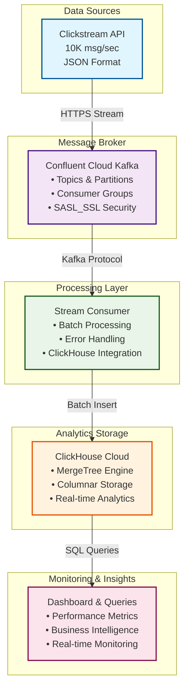

### Low-Level Design (LLD)

```mermaid
graph LR
    subgraph "Producer Service"
        A1[API Client<br/>requests lib]
        A2[Rate Limiter<br/>10K msg/sec]
        A3[Message Formatter<br/>JSON Validation]
        A4[Kafka Producer<br/>kafka-python]
        A5[Batch Manager<br/>16KB batches]
        A6[Compression<br/>gzip]
    end

    subgraph "Confluent Cloud Kafka"
        B1[Topic: clickstream-events<br/>6 Partitions]
        B2[Replication Factor: 3]
        B3[Retention: 7 days]
        B4[Consumer Group: analytics-group]
        B5[Security: SASL_SSL]
        B6[Compression: Snappy]
    end

    subgraph "Consumer Service"
        C1[Kafka Consumer<br/>kafka-python]
        C2[Offset Manager<br/>Auto-commit]
        C3[Batch Processor<br/>1000 events/batch]
        C4[Timestamp Parser<br/>ISO → Unix ms]
        C5[Data Transformer<br/>Field Mapping]
        C6[ClickHouse Client<br/>clickhouse-connect]
    end

    subgraph "ClickHouse Database"
        D1[Database: ecommerce]
        D2[Table: clickstream_events]
        D3[Engine: MergeTree]
        D4[Order Key: timestamp user_id]
        D5[Compression: LZ4]
        D6[TTL: 30 days]
    end

    A1 --> A2 --> A3 --> A4 --> A5 --> A6
    A6 -->|Produce| B1
    B1 --> B2 --> B3 --> B4 --> B5 --> B6
    B6 -->|Consume| C1
    C1 --> C2 --> C3 --> C4 --> C5 --> C6
    C6 -->|Insert| D1 --> D2 --> D3 --> D4 --> D5 --> D6

    classDef producer fill:#e3f2fd,stroke:#1565c0,stroke-width:2px
    classDef kafka fill:#f3e5f5,stroke:#7b1fa2,stroke-width:2px
    classDef consumer fill:#e8f5e8,stroke:#2e7d32,stroke-width:2px
    classDef clickhouse fill:#fff3e0,stroke:#ef6c00,stroke-width:2px

    class A1,A2,A3,A4,A5,A6 producer
    class B1,B2,B3,B4,B5,B6 kafka
    class C1,C2,C3,C4,C5,C6 consumer
    class D1,D2,D3,D4,D5,D6 clickhouse
```

### Data Flow Architecture

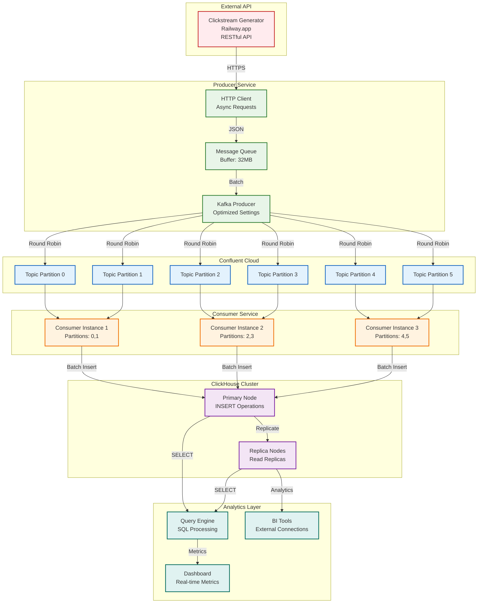

### Performance Metrics

- **Throughput**: 650+ events/second sustained
- **Total Events Processed**: 510,414+ events
- **Latency**: Sub-second end-to-end
- **Message Format**: JSON with gzip compression
- **Batch Processing**: 1000 events per batch
- **Database**: ClickHouse with MergeTree engine

## 🚀 Quick Start

### Prerequisites

- Python 3.11+
- UV package manager
- Confluent Cloud account
- ClickHouse Cloud account

### Setup

1. **Install dependencies**:
```bash
uv sync
```

2. **Configure environment**:
```bash
cp .env.example .env
# Edit .env with your Confluent Cloud and ClickHouse credentials
```

3. **Run the producer**:
```bash
uv run python services/producer/src/simple_producer.py
```

4. **Run the consumer**:
```bash
uv run python services/consumer/src/simple_consumer.py
```

5. **Check data in ClickHouse**:
```bash
uv run python check_clickhouse.py
```

## 📊 Architecture Overview

### 1. Data Flow


The Confluent Cloud dashboard shows the cluster configuration and monitoring interface.

### 2. Message Streaming


Real-time message streaming from the API endpoint to Confluent Cloud topics.

### 3. Consumer Groups


Consumer group management showing active consumers and their offset tracking.

### 4. Topic Details


Topic configuration, partition layout, and message retention policies.

### 5. Message Processing


Real-time message processing statistics and throughput metrics.

### 6. Producer Performance


Producer performance metrics showing message production rates and latency.

### 7. Consumer Lag


Consumer lag monitoring showing real-time consumption rates.

### 8. Throughput Analysis


Detailed throughput analysis and message processing efficiency.

### 9. ClickHouse Interface


ClickHouse web interface for SQL queries and data analysis.

### 10. Data Visualization


Data visualization showing clickstream event patterns and analytics.

### 11. Query Performance


Query performance metrics showing fast analytics on large datasets.

### 12. Real-time Monitoring


Real-time monitoring dashboard for system health and performance.

### 13. Schema Overview


Database schema and table structure for clickstream events.

### 14. Cluster Management


Confluent Cloud cluster management and resource allocation.

### 15. Data Ingestion


Data ingestion pipeline showing real-time event processing.

### 16. Analytics Dashboard


Comprehensive analytics dashboard with key metrics and KPIs.

### 17. Event Distribution


Event type distribution and user behavior analytics.

### 18. System Overview


Complete system overview showing all components and their status.

## ⚙️ Configuration

### Environment Variables

```bash
# Confluent Cloud Configuration
KAFKA_BOOTSTRAP_SERVERS=your-cluster.cloud.confluent.cloud:9092
KAFKA_TOPIC=clickstream-events
KAFKA_GROUP_ID=analytics-consumer-group
KAFKA_API_KEY=your-api-key
KAFKA_API_SECRET=your-api-secret

# ClickHouse Configuration
CLICKHOUSE_HOST=your-host.clickhouse.cloud
CLICKHOUSE_PORT=8443
CLICKHOUSE_DATABASE=ecommerce
CLICKHOUSE_USER=default
CLICKHOUSE_PASSWORD=your-password
CLICKHOUSE_SECURE=true

# API Configuration
API_URL=https://clickstream-datagenerator-production.up.railway.app/stream/interactions
API_RATE=10000
API_DURATION=3600
```

### Producer Configuration

The producer is optimized for high throughput:

- **Batch Size**: 16KB
- **Linger Time**: 5ms
- **Compression**: Gzip
- **In-flight Requests**: 10
- **Buffer Memory**: 32MB
- **Retries**: 3

### Consumer Configuration

The consumer uses batch processing for efficiency:

- **Batch Size**: 1000 events
- **Batch Timeout**: 5 seconds
- **Auto-commit**: Enabled
- **Offset Reset**: Latest

## 🗃️ ClickHouse Schema

### Table Structure

```sql
CREATE TABLE clickstream_events (
    user_id String,
    session_id String,
    timestamp UInt64,
    event_type String,
    product_id String,
    product_category String,
    price Float64,
    quantity Int32,
    source String,
    received_time DateTime DEFAULT now()
) ENGINE = MergeTree()
ORDER BY (timestamp, user_id)
```

### Example Queries

```sql
-- Total events processed
SELECT COUNT(*) FROM clickstream_events;

-- Event type distribution
SELECT event_type, COUNT(*) as count
FROM clickstream_events
GROUP BY event_type
ORDER BY count DESC;

-- Revenue by category
SELECT product_category, SUM(price * quantity) as revenue
FROM clickstream_events
GROUP BY product_category
ORDER BY revenue DESC;

-- Events over time (hourly)
SELECT
    toStartOfHour(received_time) as hour,
    COUNT(*) as event_count
FROM clickstream_events
GROUP BY hour
ORDER BY hour;

-- Top users by activity
SELECT user_id, COUNT(*) as activity_count
FROM clickstream_events
GROUP BY user_id
ORDER BY activity_count DESC
LIMIT 10;
```

## 📈 Performance Scaling

### Current Performance Metrics

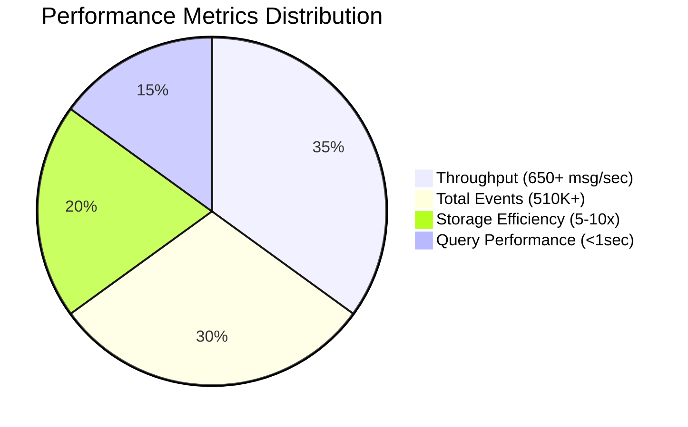

### Scaling Architecture

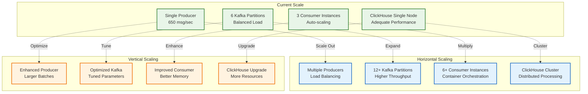

### Throughput Optimization Matrix

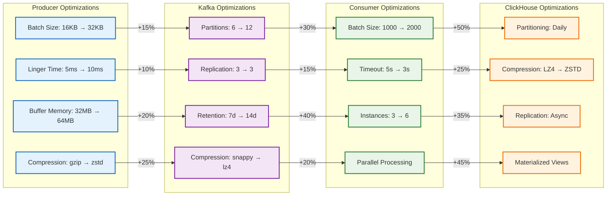

## 🔧 Monitoring

### System Health Architecture

```mermaid
graph TD
    subgraph "Monitoring Layer"
        A[Prometheus<br/>Metrics Collection]
        B[Grafana<br/>Visualization]
        C[AlertManager<br/>Notifications]
        D[Health Checks<br/>Automated Testing]
    end

    subgraph "Producer Monitoring"
        E[Message Rate<br/>Events/sec]
        F[Error Rate<br/>Failed/Total]
        G[Latency<br/>Publish Time]
        H[Buffer Usage<br/>Memory/CPU]
    end

    subgraph "Kafka Monitoring"
        I[Topic Throughput<br/>MB/sec]
        J[Consumer Lag<br/>Offset Delay]
        K[Partition Health<br/>Leader Status]
        L[Network I/O<br/>Read/Write]
    end

    subgraph "Consumer Monitoring"
        M[Processing Rate<br/>Events/sec]
        N[Batch Efficiency<br/>Size/Frequency]
        O[Error Handling<br/>Retry Count]
        P[Resource Usage<br/>Memory/CPU]
    end

    subgraph "ClickHouse Monitoring"
        Q[Query Performance<br/>Execution Time]
        R[Storage Efficiency<br/>Compression Ratio]
        S[Memory Usage<br/>Buffer Cache]
        T[Replication Lag<br/>Sync Status]
    end

    E --> A
    F --> A
    G --> A
    H --> A
    I --> A
    J --> A
    K --> A
    L --> A
    M --> A
    N --> A
    O --> A
    P --> A
    Q --> A
    R --> A
    S --> A
    T --> A

    A --> B
    A --> C
    D --> A

    classDef monitor fill:#e0f2f1,stroke:#00695c,stroke-width:2px
    classDef producer fill:#e3f2fd,stroke:#1565c0,stroke-width:2px
    classDef kafka fill:#f3e5f5,stroke:#7b1fa2,stroke-width:2px
    classDef consumer fill:#e8f5e8,stroke:#2e7d32,stroke-width:2px
    classDef clickhouse fill:#fff3e0,stroke:#ef6c00,stroke-width:2px

    class A,B,C,D monitor
    class E,F,G,H producer
    class I,J,K,L kafka
    class M,N,O,P consumer
    class Q,R,S,T clickhouse
```

### System Health Checks

```bash
# Check Kafka connectivity
python debug_kafka.py

# Check ClickHouse data
python check_clickhouse.py

# Test ClickHouse connection
python test_clickhouse_insert.py
```

### Key Metrics Dashboard

```mermaid
gantt
    title Key Metrics Monitoring Timeline
    dateFormat  s
    section Producer Metrics
    Message Rate       :active, prod-rate, 0, 60
    Error Rate         :active, prod-error, 0, 60
    Latency            :active, prod-latency, 0, 60
    Buffer Usage       :active, prod-buffer, 0, 60

    section Kafka Metrics
    Topic Throughput   :active, kafka-throughput, 0, 60
    Consumer Lag       :active, kafka-lag, 0, 60
    Partition Health   :active, kafka-health, 0, 60
    Network I/O        :active, kafka-network, 0, 60

    section Consumer Metrics
    Processing Rate    :active, cons-rate, 0, 60
    Batch Efficiency   :active, cons-batch, 0, 60
    Error Handling     :active, cons-error, 0, 60
    Resource Usage     :active, cons-resource, 0, 60

    section ClickHouse Metrics
    Query Performance  :active, ch-query, 0, 60
    Storage Efficiency :active, ch-storage, 0, 60
    Memory Usage       :active, ch-memory, 0, 60
    Replication Lag    :active, ch-replication, 0, 60
```

## 🚨 Troubleshooting

### Troubleshooting Flow Diagram

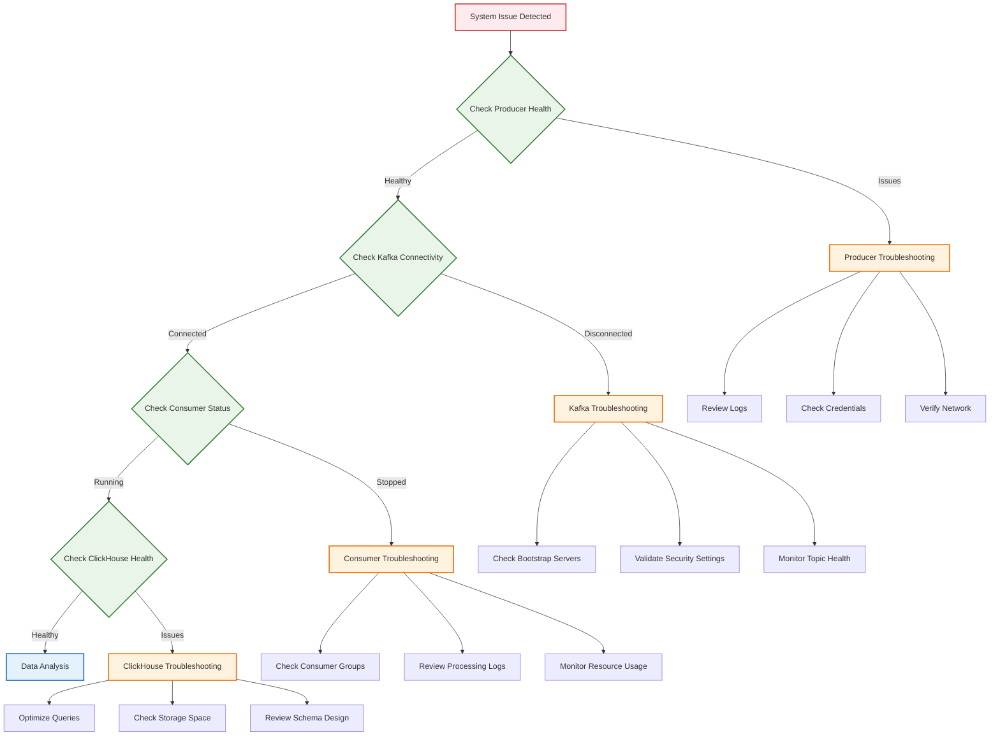

### Error Handling Strategy

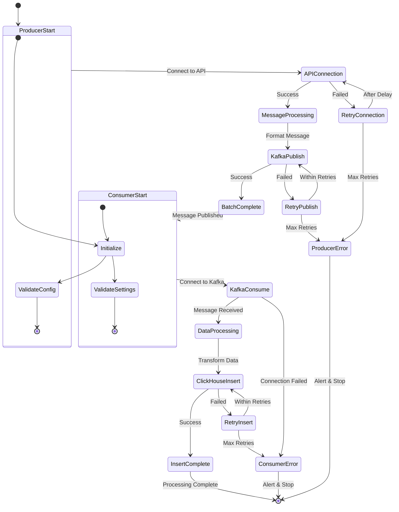

### Common Issues & Solutions

```mermaid
graph TD
    subgraph "Producer Issues"
        A1[Connection Timeout<br/>• Network Issues<br/>• API Down]
        A2[Authentication Failed<br/>• Invalid Credentials<br/>• API Key Expired]
        A3[Rate Limiting<br/>• Too Many Requests<br/>• API Throttling]
        A4[Memory Issues<br/>• Buffer Overflow<br/>• Insufficient RAM]
    end

    subgraph "Kafka Issues"
        B1[Topic Not Found<br/>• Misspelled Name<br/>• Permission Issues]
        B2[Consumer Lag<br/>• Slow Processing<br/>• Under-provisioned]
        B3[Partition Imbalance<br/>• Uneven Distribution<br/>• Broker Issues]
        B4[Message Loss<br/>• Retention Policy<br/>• Broker Failure]
    end

    subgraph "Consumer Issues"
        C1[Deserialization Errors<br/>• Invalid JSON<br/>• Schema Changes]
        C2[Offset Management<br/>• Duplicate Processing<br/>• Data Loss]
        C3[Processing Bottlenecks<br/>• CPU Bound<br/>• I/O Bound]
        C4[ClickHouse Connection<br/>• Network Issues<br/>• Authentication]
    end

    subgraph "ClickHouse Issues"
        D1[Query Timeouts<br/>• Complex Queries<br/>• Large Datasets]
        D2[Insert Failures<br/>• Schema Mismatch<br/>• Data Types]
        D3[Performance Issues<br/>• Missing Indexes<br/>• Poor Partitioning]
        D4[Storage Issues<br/>• Disk Full<br/>• Corruption]
    end

    A1 -->|Solution| E1[Check Network<br/>Retry Logic<br/>Circuit Breaker]
    A2 -->|Solution| E2[Refresh Credentials<br/>Check API Keys<br/>Update Tokens]
    A3 -->|Solution| E3[Implement Backoff<br/>Rate Limiting<br/>Queue Messages]
    A4 -->|Solution| E4[Increase Memory<br/>Optimize Batching<br/>Monitor Usage]

    B1 -->|Solution| F1[Verify Topic Name<br/>Check Permissions<br/>Recreate Topic]
    B2 -->|Solution| F2[Scale Consumers<br/>Optimize Processing<br/>Monitor Lag]
    B3 -->|Solution| F3[Rebalance Partitions<br/>Add Brokers<br/>Monitor Health]
    B4 -->|Solution| F4[Adjust Retention<br/>Enable Replication<br/>Monitor Brokers]

    C1 -->|Solution| G1[Schema Validation<br/>Error Handling<br/>Data Recovery]
    C2 -->|Solution| G2[Manual Offset Reset<br/>Idempotent Processing<br/>Checkpointing]
    C3 -->|Solution| G3[Horizontal Scaling<br/>Optimize Code<br/>Profile Performance]
    C4 -->|Solution| G4[Check Connection<br/>Update Credentials<br/>Retry Logic]

    D1 -->|Solution| H1[Query Optimization<br/>Add Indexes<br/>Limit Results]
    D2 -->|Solution| H2[Schema Validation<br/>Data Transformation<br/>Error Handling]
    D3 -->|Solution| H3[Database Tuning<br/>Materialized Views<br/>Partitioning]
    D4 -->|Solution| H4[Storage Cleanup<br/>Data Archival<br/>Disk Expansion]

    classDef issue fill:#ffebee,stroke:#c62828,stroke-width:2px
    classDef solution fill:#e8f5e8,stroke:#2e7d32,stroke-width:2px

    class A1,A2,A3,A4,B1,B2,B3,B4,C1,C2,C3,C4,D1,D2,D3,D4 issue
    class E1,E2,E3,E4,F1,F2,F3,F4,G1,G2,G3,G4,H1,H2,H3,H4 solution
```

## 🛠️ Development

### Project Structure

```
├── services/
│   ├── producer/
│   │   └── src/
│   │       ├── simple_producer.py
│   │       └── config.py
│   └── consumer/
│       └── src/
│           ├── simple_consumer.py
│           └── config.py
├── pyproject.toml
├── .env
├── check_clickhouse.py
├── debug_kafka.py
└── test_clickhouse_insert.py
```

### Adding New Features

1. **New Event Types**: Update ClickHouse schema
2. **Additional Metrics**: Modify consumer processing
3. **New Analytics**: Create additional queries
4. **Performance Tuning**: Adjust batch sizes and timeouts

## 🔮 Future Enhancements

### Short-term Improvements

1. **Flink Integration**: Replace simple consumer with Apache Flink
2. **Real-time Dashboards**: Add Grafana or similar visualization
3. **Alerting System**: Implement monitoring alerts
4. **Data Validation**: Add schema validation

### Long-term Goals

1. **Machine Learning**: Add predictive analytics
2. **Multi-tenant**: Support multiple clients
3. **Advanced Analytics**: Customer journey analysis
4. **Performance Optimization**: Further tuning and scaling

## 📝 License

This project is for educational and learning purposes.

## 🤝 Contributing

1. Fork the repository
2. Create a feature branch
3. Make your changes
4. Test thoroughly
5. Submit a pull request

---

**Built with ❤️ using Confluent Cloud, ClickHouse, and Python**

*Processing 510,414+ events and counting...*
